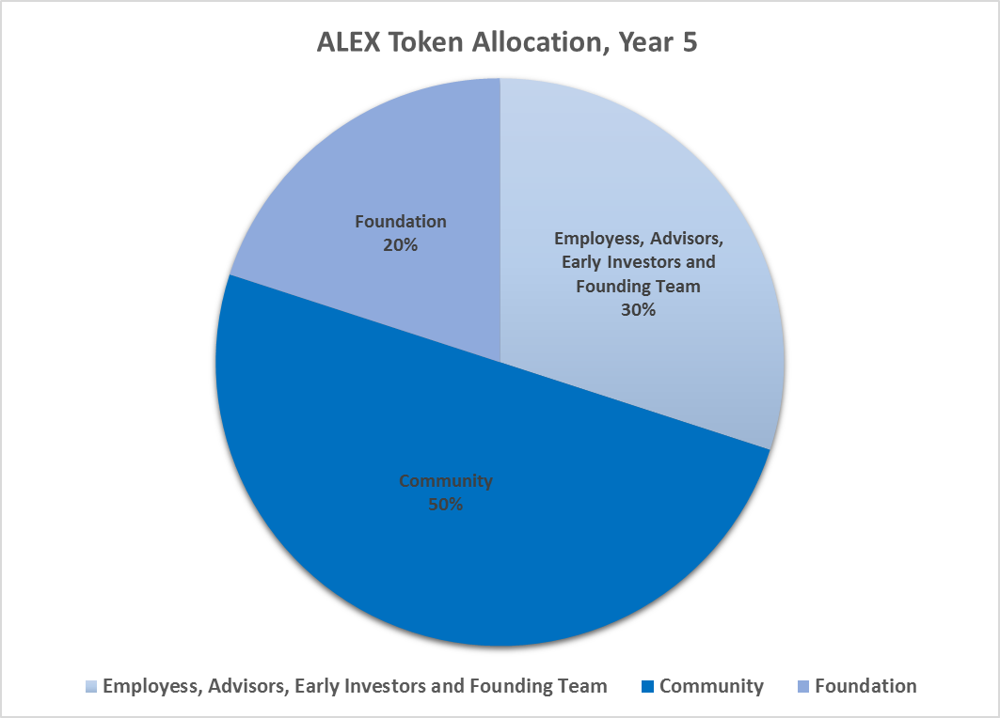
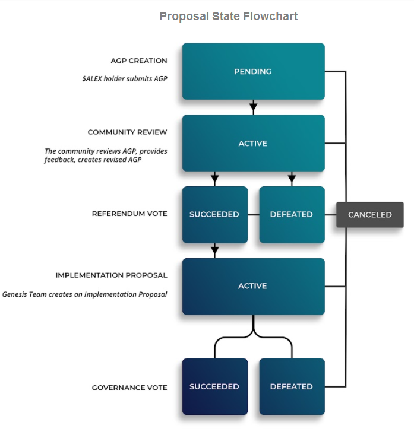
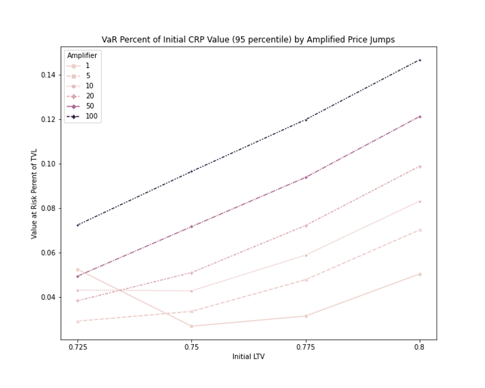
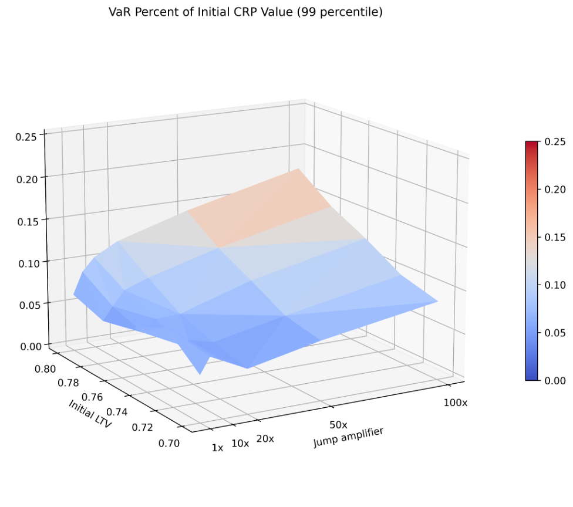
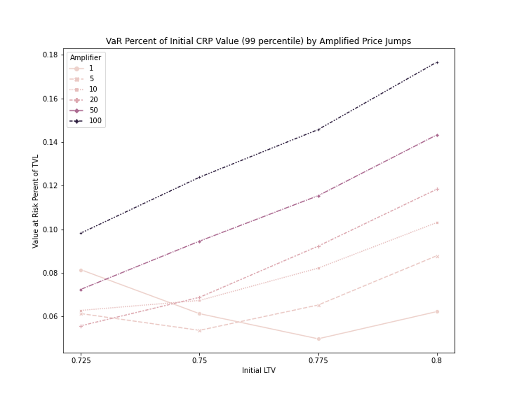
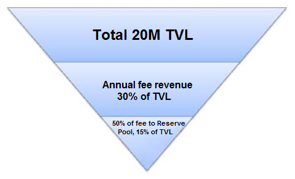

# 💰 Tokenomics

ALEXnomics charts a course toward the decentralization and autonomy of the ALEX protocol. Given a common thread of an ALEX token to bind them, how does an amorphous community weave itself towards a tapestry? Tokenomics is not a series of binary “do or don’t” gates, but of incentives and self-governance as steering mechanisms to guide a community toward maximizing its utility.

In this paper we lay out the framework for progressive governance and liquidity decentralization, with the vision of establishing an enduring public institution. ALEX balances incentivizing our early liquidity providers with the long term interest of the platform, through “cap” and “gate” mechanisms from traditional finance.

We also introduce quantitative risk analysis to Tokenomics, using Value-at-Risk modeling and statistical simulations in our risk management framework. We’re able to simulate Black Swan events worse than any historically recorded to ensure ALEX is robust in any market environment, as well as our defensive measures should a shortfall event occur.

## **What is ALEX?**

ALEX is an open-source DeFi protocol on Bitcoin via Stacks’ smart contracts. The vision of ALEX is to contribute towards the financial infrastructure needed to realize Web3. We help realize this by providing the following basic elements of a mature financial system:

Markets:

* Launchpad provides an interface for new project launches.
* Decentralized exchange with both AMM (Automated Market Maker) and off chain order-book to facilitate liquidity for projects built on Stacks

Financial Instruments:

* We introduce fixed-rate and fixed-term lending and borrowing markets — effectively creating the first zero-coupon bonds in the DeFi space

Leverage

* We offer the use of leverage for the pursuit of higher returns, both through margin trading as well as yield farming

Notably we eliminate the risk of forced liquidation through the [use of dynamic collateral rebalancing pools](https://medium.com/alexgobtc/whitepaper-2-automated-market-making-of-the-collateral-rebalancing-pool-937f1068fe0).

By establishing these financial primitives, the building blocks of a financial ecosystem, more advanced financial instruments can be subsequently recreated in DeFi space.

## **ALEX Token**

Tokens are an effective mechanism to distribute the fundamental value of a project. ALEX token, noted as **$ALEX is a medium for the exchange of time value and risk/return preferences**. $ALEX is the participation token of the platform and protocol that provides protocol & platform governance benefits to a governance participant who holds $ALEX. $ALEX is also the medium by which participants of platform activities — namely provision of liquidity on our DEX and staking — are incentivized. $ALEX can be acquired through our DEX, LP participation and staking, with three main functionalities:

### **Incentives**

The primary utility of $ALEX is to serve as the medium by which participants of platform activities — namely provision of liquidity on our DEX and staking — are incentivized. $ALEX emissions will sustainably drive adoption and continued participation, engaging a community of users and strategic partners.

### **Staking**

$ALEX can be locked for a voluntary period of time, to earn $ALEX as rewards. 50% of the initial token supply is allocated for staking where $ALEX or Liquidity Tokens can be locked for a voluntary period of time earning $ALEX as rewards.

### **Voting**

$ALEX is the mechanism for entering and exiting the ALEX community, as well as for voting and platform governance.

$ALEX holders have voting rights on, but not limited to:

* Future platform development
* Transaction fee rebate to liquidity providers
* Staking policy
* Reserve fund distribution policy
* ALEX token supply policy (including buyback and increase)

## **Progressive Governance Decentralization**

ALEX approaches governance decentralization progressively, through a process where the founding team increasingly relinquishes control over time. It allows the team to focus on and catalyze network development at its initial stage. Networks can distribute tokens, for example. Tokens decentralize the control, operation, and management of the network itself. At the same time, progressive decentralization creates a path toward regulatory compliance.

The framework of our legal entity setup is governed by the ALEX Lab Foundation, currently consisting of the ALEX team. The goal of the Foundation is to progressive transition into a full DAO with every $ALEX holder an eligible Foundation member.

### **Token Distribution**

The Issuer Co issues a total initial supply of 1,000,000,000 (one billion) ALEX governance tokens, $ALEX. The total initial supply is allocated as the following

* 20% to the Foundation, to be allocated to the Community Reserve Pool to support the ecosystem, early adopters and future development of ALEX
* 50% is reserved for the community staking $ALEX or Liquidity Tokens to earn $ALEX
* 30% to employees, advisors and early investors and founding team

<figure><figcaption>

</figcaption></figure>

<figure><figcaption>

</figcaption></figure>

### **Community Token Emission Schedule**

Different staking pools may have different token emission schedules, reflecting differentiated risks associated with the underlying pools/assets.

The launch of a staking pool will require 20 unique wallets to signal activation as part of a function in the smart contract, after which a countdown begins and anyone is eligible to stake within a given Stacks block thereafter.

Across all staking pools, the total emission of $ALEX will be capped to:

<figure><figcaption>

</figcaption></figure>

## **Governance**

ALEX not only builds decentralized finance but is also committed to decentralizing the entire project progressively. The goal of the ALEX Lab Foundation is to become a full-fledged DAO, one which gives the ALEX community complete control over both on-chain and off-chain governance decisions. However, this is a complex process, one which will have to be approached incrementally and deliberately by necessity.

### **ALEX Genesis DAO**

The first step toward progressive decentralization of governance is the creation of ALEX Genesis DAO. Approximately 60 days after Mainnet launch, the Foundation will announce a Genesis Team as well as a formalized ALEX Growth Proposal (AGP) framework through which any $ALEX holder can submit a proposal for community consideration.

The Genesis Team will consist of ALEX Team members that act as an intermediary between the community and the Foundation. AGPs may be as simple as a slight adjustment to transaction fees to as complex as adding new functionalities or adding cross-chain assets. The Genesis Team will review community-approved AGPs, and provide an implementation proposal on the feasibility and time required to execute the AGP. The implementation proposals will be open to a vote by $ALEX holders.

<figure><figcaption>

</figcaption></figure>

<figure><figcaption>

</figcaption></figure>

[https://miro.medium.com/max/1400/0\*4WIBBTw2mEzsiPaF](https://miro.medium.com/max/1400/0\*4WIBBTw2mEzsiPaF)

[https://miro.medium.com/max/1394/0\*5Zh-29vUmGg6Kt4a](https://miro.medium.com/max/1394/0\*5Zh-29vUmGg6Kt4a)

The Genesis DAO will be in place for the first 6–18 months after mainnet, empirically determining the best governance practices together with the community. Although every effort will be made to respect the finality of the governance vote, as a failsafe the Foundation will have veto power and the ability to suspend the governance system.

Once the governance system is operating in a reliable, distributed manner, the transition to the formal ALEX DAO will begin. The Genesis Team will suggest that the fail-safe be removed and the community will vote on transferring all governance to the ALEX DAO.

## **Progressive Liquidity Decentralization**

DeFi protocols have to balance bootstrapping initial liquidity while maintaining long-term usage. Incentivizing provision of short-term liquidity has been compared to “renting” liquidity. Short-term incentives attract mercenary capital that captures a significant portion of the initial rewards and then summarily exits shortly thereafter to pursue the next highest yielding project. Smaller protocol users are demoralized as exploitative behavior is rewarded.

Borrowing from traditional money managers’ liquidity management through a series of gates, ALEX creates mechanisms of liquidity commitment. This will filter for LPs who are committed to the long-term growth of ALEX, as we achieve Progressive Liquidity Decentralization (PLD).

Progressive liquidity decentralization is managing the transition from the concentrated liquidity that characterizes the launch of a platform, towards a state of decentralized liquidity where no individual or small group of individuals control the majority of the platform liquidity.

ALEX will introduce a “cap” on the amount a single liquidity provider can contribute as well as “gates” that will manage an orderly exit of capital, with a view to ensuring that no single LP can be more than a certain percentage of total liquidity and a long-term liquidity commitment is rewarded.

This serves to align the interest of our Liquidity Providers with the interests of the ALEX community and protocol, which best ensures the long term growth, prosperity and price appreciation of the ALEX Token.

## **Risk Management of ALEX Reserve Pool**

How will a Black Swan event impact the ALEX platform? How should one “quantify” the risk? And what are the measures taken to ensure ALEX’s solvency?

ALEX essentially consists of two parts: a Decentralized Exchange (DEX) and a platform for loanable funds (PLF). The former facilitates the swapping activities, whereas the latter is lending/borrowing. PLF typically requires over-collateralization, meaning the value of the loan is typically lower than the collateralization value to ensure that the loans stay afloat.

When the market is distressed, the collateral value is likely to be lower than the loan value, which triggers a default. Most DeFi lend/borrow protocols introduce “liquidators”, who would unwind the collateral pool by imposing a hefty fee, causing a significant loss to the borrowers.

To ensure a smooth borrowing/lending experience, ALEX employs Collateral Rebalancing (white paper link [here](https://medium.com/alexgobtc/whitepaper-2-automated-market-making-of-the-collateral-rebalancing-pool-937f1068fe0)) by constantly rebalancing the collateral pool between risky and riskless assets to avoid forced liquidation.

Despite all cautious measures, a Black Swan event could result in a drastic fall in collateral value, causing risky assets unable to be converted fully to riskless assets in time. While borrowers walk away with a default, ALEX platform takes the hit.

How can ALEX ensure its platform sustainability? To answer this question, we start with a framework to quantify the market risk. Then we design various lines of defense to protect ALEX’s solvency.

### **Value At Risk (VaR)**

VaR is a statistical framework in risk management that quantifies risk exposure. Commonly applied in traditional finance, it is defined as the _**maximum dollar amount expected to be lost over a given time horizon**_. VaR, for example, allows a financial institution to say “We are 99% confident our losses will not exceed $5M in one trading day.”

ALEX’s risk modeling is conservative:

1. We focus on the extreme loss occurring events with extremely low probability.
2. To magnify the market dislocation, we simulate magnified “jumps” in crypto price movement, meaning the price could suddenly gap down to unprecedented levels.

For instance, in the past five years, the largest negative hourly jump size is 18%. The probability of a jump size between -10% and -18% is as low as 0.017%. To study the impact of possible Black Swan events, we randomly add negative jumps sizes of 20%, amplifying the probability of jumps to 100 times the historical average.

These simulations provide insight into the magnitude of the loss that the platform would incur. For example, with an initial LTV of 75% and the jump frequency 100 times higher than the historical average, the **probability is less than 1% to have 12.5% of the collateral value to default.**

Furthermore, under reasonable assumptions on the size of the collateral rebalancing pool and ALEX annual fee revenue, we can compare the loss with the revenue generated by ALEX through transaction fees. In the case study listed in the appendix (with collateral pool size is assumed to be 31.25% and the monthly fee revenue 1.25% of the total TVL), **we conclude that the loss incurred to the platform is equivalent to roughly 3 months fee.**

**The severity of the black swan events modeled here provides confidence that the elimination of liquidation risk on ALEX is sustainable in the long term.**

### **Shortfall Event**

If, for any unforeseen reason, a Shortfall Event occurs, the first line of defense is the ALEX Reserve Pool. The Reserve Pool’s main income is transaction fees. As we rebate LPs a percentage of the transaction cost, the rest will be assigned to the Reserve Pool automatically. Subject to governance, Reserve Pool size is relative to platform risk and may trigger $ALEX buyback or new issuance. So long as the Reserve Pool is solvent, it will cover the losses of minor shortfall events with no suspension of protocol operations.

Should the Reserve Pool become insolvent, subject to a vote of approval from the community, more ALEX Token may be issued. This is the second line of defense. All proceeds of the sale would go to the Reserve Pool, until shortfall loss is covered.

## **Conclusion**

ALEX is a protocol built by veteran quants who have built the quantitative trading and risk management systems for Wall St. banks. We have taken that knowledge and expertise into DeFi and tokenomics. For our risk management, rather than rely on a “token reserve” of arbitrary size, we apply statistical modeling to draw inference on how ALEX will be resilient to Black Swan events.

Decentralization is our greatest strength, as it allows us to create an open and adaptive protocol that can evolve in entirely new ways. The progressive decentralization of governance we pursue begins with our Genesis Dao.

The progressive decentralization of liquidity we pursue through mechanisms of commitment unique to DeFi. By introducing “caps” on the amount a single LP can contribute as well as “gates” that will manage an orderly exit of capital, we balance incentivizing our early LPs with the long-term interests of the ALEX protocol and community. ALEX seeks partnership and community from our ecosystem to establish enduring financial infrastructure.

This has been only a quick introduction to ALEX Token to present an overview of our token utility and broader tokenomics. Look out for more blog posts in the very near future, and please check our documentation and social media channels for more information.\[1]

## **Appendix**

### **Scenario analysis: Likelihood of and Impact of a Shortfall Event**

In the event of extreme adverse market conditions (Black Swan event), the Collateral Rebalancing Pool (CRP) is likely to be most impacted because borrowers default on their loans. To quantify the impact of our capital sufficiency, we rely on simulation techniques.

Let’s assume the CRP holds BTC-UDSC as a risky-riskless asset pair, with a contract loan term of three months. In the simulation, we assume the BTC-USD price follows a Brownian motion with a jump diffusion:

1. The Brownian motion has an annualized average return of -200%. This is equivalent to a 50% BTC price drop within three months, which is among the worst scenarios ever observed in BTC history. Annualize volatility is calibrated to 100% (average annual volatility of the last 5 years is \~ 80%)
2. To be conservative, we add a jump diffusion process, defined as the following: where is the BTC price at t and t-1 hour respectively.

In the past five years, the largest negative hourly Jump size is 18%. The probability of a Jump between -10% and -18% is as low as 0.017%. To study the impact of possible Black Swan events, we randomly add negative jump sizes of 20% to the brownian motion, amplifying the probability of a jump to 1, 10, 20, 50 and 100 times of historical average.

Another key parameter to calibrate is Loan-to-Value (LTV), the ratio of the loan amount to the value of the collaterals. The larger the LTV, the more chance the loss could occur to the platform. We assume LTV is between 70% and 80%, a relatively high level to all other Defi projects.

Figures 1 and 2 assume that loss occurs at 5% probability within the duration of a three-month loan. \*\*\*\*The loss is expressed as a percentage of initial CRP value with respect to LTV and price jump amplifiers. Unsurprisingly, the higher chance of loss corresponds to a larger initial LTV. For example, when BTC-USD price jump is 100 times more frequent than the historical average, and a LTV of 75% LTV, 10% of the collateral would default.

Figures 3 and 4 studies the loss occurring at 1% probability during three months. Using the same assumption on jumps before, and a LTV of 75% LTV, 10% of the collateral would default.

<figure><figcaption>

</figcaption></figure> <figure><figcaption>

</figcaption></figure>

<figure><figcaption>

</figcaption></figure> <figure><figcaption>

</figcaption></figure>

<!-- <figure><figcaption>

</figcaption></figure>

<figure><figcaption>

</figcaption></figure>

<figure><figcaption>

</figcaption></figure>

<figure><figcaption>

</figcaption></figure> -->

### **How to Interpret the platform loss**

We hope to provide an intuitive framework to analyze the platform loss in case of market stress. Certain assumptions are imposed, allowing us to quantify the loss relative to the platform revenue.

Assuming TVL is $20mn, which is comparable to similar Defi projects in their initial launch stage. Annual fee revenue is assumed to be 30% of the TVL, of which 50% is allocated to the LP, and 50% would be left at ALEX Reserve Pool.

<figure><figcaption>

</figcaption></figure>

We assume an equal split of TVL, i.e. $10Mn, between DEX and borrowing/lending pool. The value of Token and yieldToken shouldn’t be distant, as long as the interest rate is kept within a reasonable range. Therefore, the value of the yield Token in ALEX is assumed to be 5mm. As minting yieldToken requires collateral, an LTV of 80% means that the collateral amount in the pool is equivalent to 6.25mm, a ratio of 31.25% to the total TVL of ALEX.

According to our simulation, in the extreme case of 100X jump amplifiers and 75% initial LTV, the platform could lose 12.5% of the collateral pool with a probability of less than 1%, if market catastrophe leads to liquidity vacuum and risky assets unable to convert to riskless assets on time. Translating to the ratio of TVL, this loss is equivalent to around 3.9% of the total TVL of ALEX. Under our fee assumption, ALEX generates monthly fee equivalents to 2.5% of the total TVL, among which 1.25% will be allocated to the Reserve Pool. **Therefore, our loss is slightly higher than the 3-month cumulative fee of the platform.**

\[1] After Mainnet launch, $ALEX can be acquired through our DEX or earned as incentives by anyone who is a liquidity provider or our DEX or stakes $ALEX with the platform. More information about the Mainnet launch and how to acquire your first $ALEX will be published soon. We encourage our community to participate in ALEX Testnet, as every participant contributes to the improvement of ALEX and is a true asset to the ALEX community.
