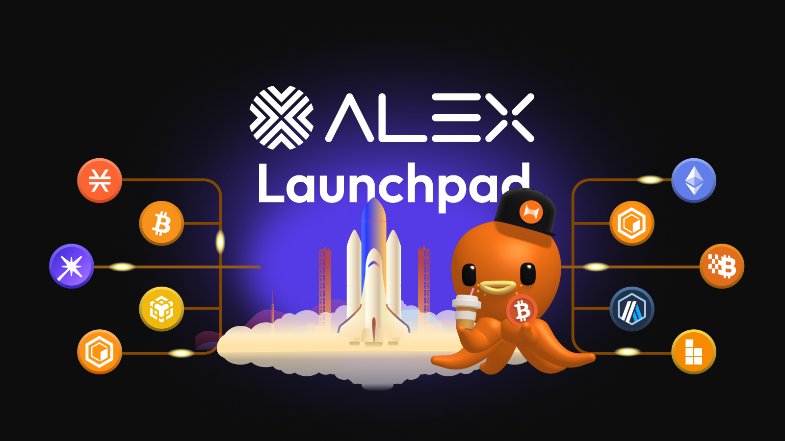
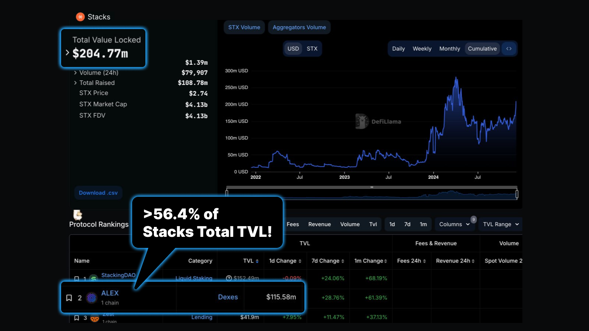
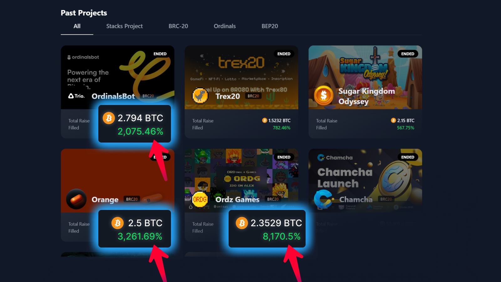
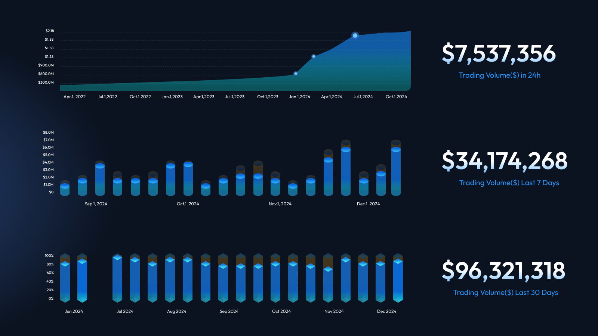
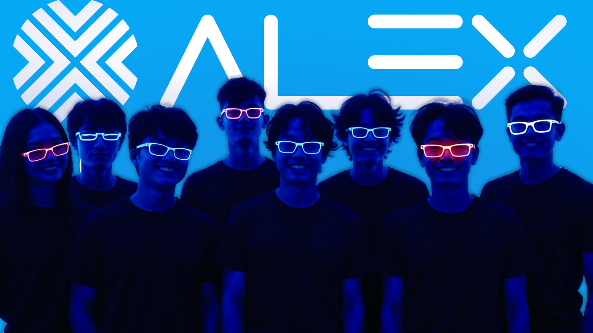
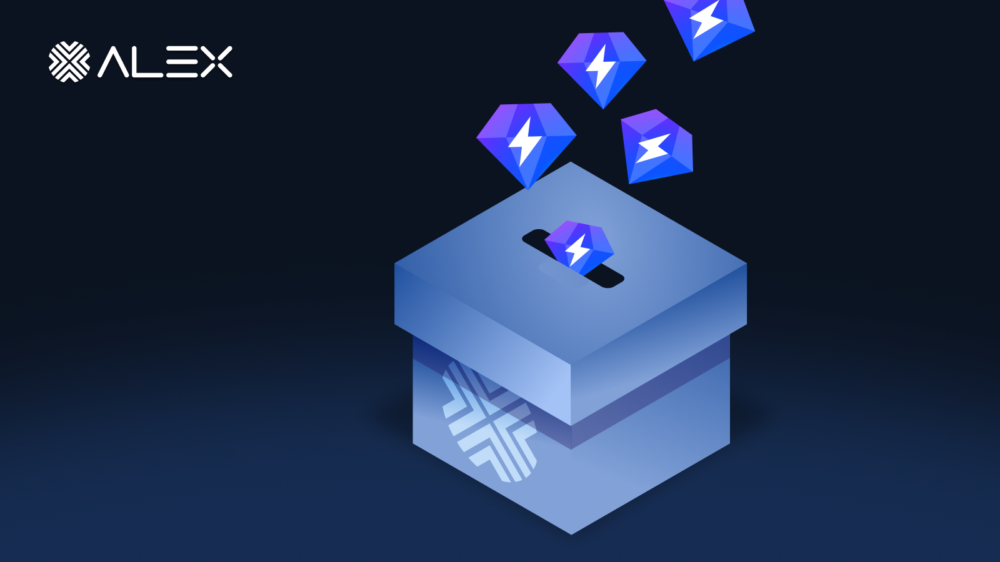
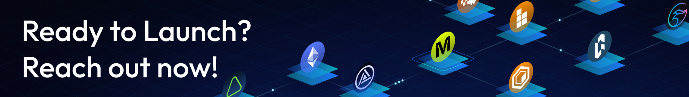

# Join the ALEX Launchpad!

<figure><figcaption>
Welcome to the ALEX Launchpad!
</figcaption></figure>

Welcome to the ALEX Launchpad — the best launchpad built on Bitcoin!


**Backstory:** The ALEX Launchpad is the first launchpad built on Bitcoin since February 2022, having facilitated more than 10+ successful launches with up to \~355.9 BTC committed by the community to date! Plus, the options to bridge to more than 18+ networks!


### What is the ALEX Launchpad?&#x20;

The ALEX Launchpad is a community-based IDO integrated with [XLink](https://www.xlink.network/) to enable multichain support for projects to raise funds and launch their projects on up to 18 different networks.

<figure><figcaption></figcaption></figure>

### Why Raise with the ALEX Launchpad?

The ALEX Launchpad provides you with the highest probability of success while incurring the least amount of downside risk. Here's why:

* \#1: ALEX has the highest DEX activity and social metrics.
* \#2: ALEX is expansive and backed by strong momentum.
* \#3: We provide top-class support from our team before, during, and after the launch to ensure maximum success.
* \#4: Our IDO terms are designed to be fair with very low risks for both you and your community.

### #1: ALEX by the Numbers

<figure><figcaption>
DeFillama Stats
</figcaption></figure>

As of December 2024, the ALEX Ecosystem is ranked the #1 for the highest, here are the stats:

* **TVL :** $219.8M
* **Total Trading Volume:** $2.4B+
* **Active Users:** 69K+
* **Supported Networks:** 19+ Network (via XLink)
* **Funds Raised:** 11.32 BTC , 400K USDT, 16.5K ALEX
* **Appx. Funds Committed:** \~355.9 BTC (_Excluding other tokens_)&#x20;
* **Average Oversubscribed Ratio:** 5X+
* **ALEX in STX Ecosystem TVL Ratio: \~**&#x35;6.4%&#x20;
* **ALEX Social Metrics:**&#x20;
  * 110.5K Followers on 𝕏
  * 50.2K Members on Discord
  * 5.8K Members on Telegram
    * 500+ Members on Chinese TG
    * 1.6K Members on Korean TG
    * 1.3K Members on Japan TG
  * 46.5K Followers on XLink's 𝕏

<figure><figcaption>
Oversubscription for IDO
</figcaption></figure>

#### What is **Oversubscribed Ratio?**

The '**Oversubscribed Ratio'** refers to instances where projects receive funding that surpasses their fundraising target. For instance, if a project aims to raise $100,000 but ends up collecting $250,000, the filled percentage would exceed 100%.

In such scenarios, for every $1 pledged beyond the 100% mark, the amount is divided by the Oversubscribed Ratio, which in this example would be 2.5X. Therefore, if you allocated $100 towards the IDO, only $40 would be utilized for participation, with the remaining $60 being refunded to the community investor.

* **Appx. Funds Committed:** \~355.9 BTC (_Excluding other tokens_)&#x20;
* **Funds Raised:** 11.32 BTC , 400K USDT, 16.5K ALEX


**\~355.9 BTC is equivalent to over $33.8 million** committed to the ALEX Launchpad to date, excluding other forms of tokens! (_Assuming each BTC costs $95,000_)


A higher rate of oversubscription leads to a more dispersed allocation of tokens, ensuring the distribution is as equitable as possible.&#x20;

Historical data from past launches on the ALEX Launchpad indicate a higher likelihood of projects being oversubscribed rather than undersubscribed, thereby increasing your project's chances for a successful fundraising outcome.

### #2: ALEX DEX Momentum

<figure><figcaption>
Average ALEX AMM Data for 1D/7D/30D
</figcaption></figure>

The ALEX DEX is currently experiencing peak momentum, positioning it as the optimal platform for token listings.

When evaluating DEX momentum, we consider it a key indicator for assessing the potential visibility of your token. Higher momentum translates to greater exposure for your token, enhancing its market presence and trading opportunities.

At average, our DEX receives up to:

* \~$7-10M daily trading volume
* \~$30-40M weekly trading volume
* \~$80-110M monthly trading volume&#x20;

_These volumes does not include Bridge volume from XLink._&#x20;

### #3: Support from the ALEX Lab Foundation

<figure><figcaption></figcaption></figure>

Raising a round can be challenging but we are help to support you through and through, here are some of the supports we will be providing during the Launchpad:

* Amplification of your project across our Socials
* 𝕏 Space sessions with our communities
* Cross borders beyond English communities; we will push your contents to our partners who manages Chinese, Japanese and Korean communities
* (Optional) Tokenomic advisory
* Tap into our vast network of connections that can help

### Requirements for the Launchpad

Some of the requirements we look for from projects looking to raise with the ALEX Launchpad:

* Strong organic social followings on 𝕏&#x20;
* Working product or usable MVP(s)
* User activities metrics of your products / ecosystems
* Revenue model of your project
* Strong team background&#x20;
* (Optional) Interest from notable CEXs&#x20;
* (Optional) Revenue data of your projects&#x20;
* All IDO terms has be to agreed on.

<figure><figcaption></figcaption></figure>

### ALEX Launchpad IDO Terms

By launching on the ALEX you agree to the below terms:

1. **Fundraising Requirement:** Raise at least $100,000 through the ALEX Launchpad.
2. **Buyback Mechanism:** Agree to a one-week buyback mechanism where, if the token price falls below the Buyback price, you will buy back all tokens sold during the IDO. Example: If the IDO price is $1, the Buyback price is $0.9, and the price drops to $0.8 a week after launch, the buyback is triggered at $0.9.
3. **Liquidity Commitment:** Commit to 6-months LP staking contributing at least 10% of the funds raised and an equivalent value of 10% of your total token supply to the liquidity pool (LP) to enable trading immediately after the Launchpad concludes.&#x20;
   1. Example: For a $100,000 raise, this means contributing $10,000 in BTC/STX/sUSDT and another $10,000 worth of your token.
   2. Note: Additional liquidity can be added by anyone after the launch.
4. **Launchpad Fees:**&#x20;
   1. We charge a 0% service fee for listing
   2. < 0.5% token supply for marketing budgets&#x20;

Please review the above terms and reach out to the ALEX team with any questions or concerns by sending us a DM via our emails available in the[ Official Links](../../resources/official-links.md).

<figure><figcaption></figcaption></figure>

### The Launchpad Process

Now that you have made your mind and decided that the ALEX Launchpad is for your project, here's what to expect to happen:

#### #1: Introduction to the ALEX Team

After you've reviewed all the Launchpad information above and decided to proceed with ALEX, we'll set up a communication channel (e.g., Telegram) for an initial interaction.&#x20;

Here, we'll discuss your needs, get to know you and your project better, and a team member will schedule an introductory meeting or call to delve into your project's details and the launch process.

#### #2: Project Information Submission for Due Diligence

We will ask your team to complete a Blocksurvey form for due diligence purposes. This form will request information such as:

* Project brief & summary
* Team background
* Product information & Use cases
* Revenue Model
* Official Links & Documentation
* Current Development Phase
* Roadmaps
* Estimated IDO valuation

#### #3: Initial Call (Brief Process & Terms)

Once we receive the completed Blocksurvey form, we'll arrange a call to:

* Get to know you and your team better (preferably with video enabled)
* Discuss your current milestones, CEX listing strategies, onboarded partners, product functionality, and IDO terms.

After this call, you'll have a clear understanding of the process, terms of the IDO, and an opportunity to ask any initial questions or seek clarifications.

#### #4: Agreement to the IDO Terms

During or after the call, we'll confirm if you fully agree to the following IDO terms:

* Raise a minimum of $100K.
* Implement a buyback mechanism if the price falls below the IDO price within a week of launch.
* Commit 10% of raised funds and 10% of total token supply for initial liquidity.
* **Accept the fees terms:** 0 % service fee and <0.5% marketing budget of the token supply .

By agreeing to these terms, you commit to fulfilling these obligations during and post-IDO.

#### #5: Launchpad Fundraising Documentation Submission

If you've agreed to the IDO terms and our Launchpad Committee has vetted your project:

You'll be asked to fill out the IDO Notion Application form, detailing launch specifics, tokenomics, financial projections, marketing strategies, and other operational details.

<figure><figcaption></figcaption></figure>

#### #6: Community Vote

Once the IDO Notion Application is completed, a community vote will be conducted using all provided project information and the fundraising goal.

If the vote results in a majority YES, your project will be listed on the ALEX Launchpad.&#x20;

Users vote with their ALEX or LiALEX tokens, which are non-transferable and earned by participating in Stake and Farm within the ALEX Ecosystem.

#### #7: Launchpad Setup Post community approval:

We'll coordinate with you to set the launch date and configure settings for Community, Whitelist, and Public Round portions.

<figure><figcaption></figcaption></figure>

#### #8: Launchpad Marketing (Pre, During, and Post)

With the launchpad set up and the countdown initiated, we'll engage in co-marketing efforts as follows:

* **Pre-launch:** We will focus on announcements, teasers, and community engagement to build anticipation. &#x20;
* **During Launch:** Live updates, AMAs (Ask Me Anything sessions), and real-time interactions will keep the community engaged.&#x20;
* **Post-Launch:** We'll provide reports on the success of the IDO, send thank-you messages, and continue with ongoing community updates.

We will collaborate with you to enhance social amplification not only through our channels but also via our network connections, including Key Opinion Leaders (KOLs), ALEX holders, and investors.

If you lack a clear path to Centralized Exchange (CEX) listings, we can assist in establishing these connections.

Our marketing collaboration goes beyond merely listing your project on our website. We will also co-run marketing campaigns designed to maximize visibility and impressions for your IDO round.

During the co-marketing phase, we will host an AMA in the form of 𝕏 Spaces, allowing our 110K followers to participate live or watch the recorded session to gain a better understanding of your project.

#### #9: Launchpad Goes Live!

Once all preparations are complete, the IDO officially commences at the scheduled time. Investors can then participate in the token sale, marking the beginning of your project's fundraising phase on the ALEX Launchpad.

Each step ensures that your project is vetted, prepared, and promoted effectively within the ALEX ecosystem, leading up to a successful token launch.&#x20;

After the launchpad has completed, the unallocated funds will be returned to the investors, while the allocated funds will be converted into the IDO tokens based on the IDO launch price.

<figure><figcaption>
<strong>Send us a message via our</strong> <a href="https://t.me/AlexCommunity"><strong>ALEX Official Telegram channel</strong></a><strong>, and we will get back to you!</strong> 
</figcaption></figure>
