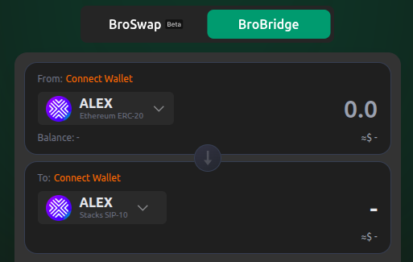

# 🪙 How To Buy ALEX Tokens

Starting from the [AlexLab](https://alexlab.co/) website, if you click on the `Buy ALEX` button, it will display all the available markets where the ALEX token can be purchased.

<figure><figcaption></figcaption></figure>

The procedure will be different depending on the marketplace you choose to buy ALEX tokens. However, if you decide to use the [Alex Lab](https://app.alexlab.co/swap) platform (the last option on the list), you can follow these detailed guides, which use the ALEX token as an example of how to perform a swap:

1. First, connect your wallet. You can follow this step-by-step guide: 
[How to connect your wallet](https://docs.alexlab.co/getting-started/how-to-connect-your-wallet)

2. Next, depending on which blockchain you are using, follow the appropriate path to obtain ALEX tokens:
- If you're a Bitcoin user: Use the Bitcoin Native Swap to get ALEX BRC-20 or Runes through Bitcoin Native Swap.
    - 📘  [Step-by-step guide](https://docs.alexlab.co/what-can-you-do/bitcoin-swaps/how-to)
    - 🔁 [Bitcoin Swap page](https://app.alexlab.co/bitcoin/swap/)
- If you're a Stacks user: Use the Stacks Swap to acquire ALEX tokens directly on the Stacks L2. 
    - 📘 [Step-by-step guide](https://docs.alexlab.co/what-can-you-do/stacks-swaps/how-to) 
    - 🔁 [Stacks Swap page](https://app.alexlab.co/swap)
    - To see which tokens you can trade in exchange for ALEX coins using the Stacks Swap, check this [token list](https://app.alexlab.co/token-list)
- If you're on another blockchain (e.g. Ethereum, BNB):
First, bridge your assets to either Stacks or Bitcoin, and then follow the appropriate method above.
    - 🔁 [Bridge page](https://app.alexlab.co/bridge/cross-bridge)

### Move ALEX Across Different Chains

It is also possible, to use [Brotocol](https://brotocol.xyz/about) to bridge ALEX across different blockchains, in case you hold ALEX on another chain and want to transfer it to another one (for example, to Stacks), as shown below.
<figure><figcaption></figcaption></figure>

 You can check the step-by-step guide [here](https://docs.brotocol.xyz/what-can-you-do/brobridge/how-to-bridge)