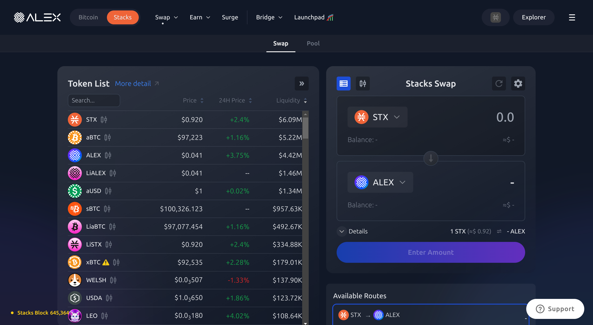
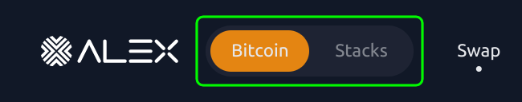
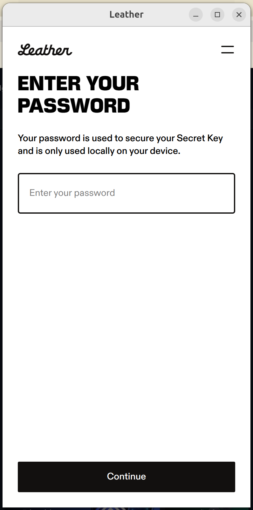
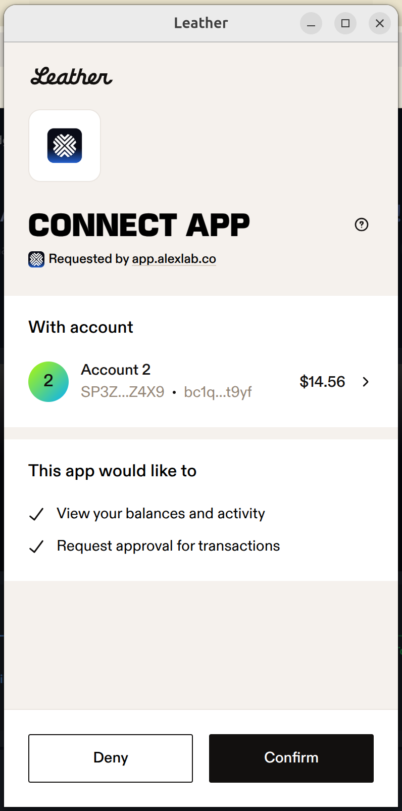
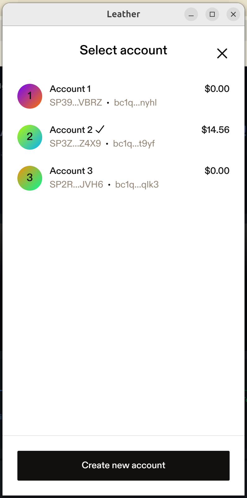
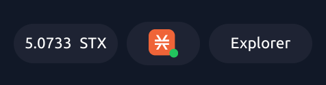

# How to Connect your Wallet

Follow these steps to connect your wallet to ALEX Lab.

[**🚀 Connect to ALEX Now!**](https://app.alexlab.co)

### Step 1: Open the Wallet Manager

<figure><figcaption>
ALEX Homepage, displaying the Swap panel
</figcaption></figure>

First, click on the **Wallet Manager** located in the top right corner of the ALEX Lab homepage. This is where you’ll manage all your wallet connections.

### Step 2: Choose the Blockchain and Wallet

By default, the ALEX Lab homepage opens the **Stacks Swap**, so the **Wallet Manager** will display wallets for the **Stacks Chain**. For the **Bitcoin Chain**, click on the slider in the top left corner to open the [Bitcoin Swap](https://app.alexlab.co/bitcoin/swap).

<figure><figcaption>
Slider for selecting Bitcoin or Stacks swap
</figcaption></figure>

In the Wallet Manager, select the blockchain you are using (e.g., **Stacks Chain**, **Bitcoin Chain** or **EVM Chain**), then choose the wallet that you want to connect. Supported wallets include Leather, Xverse, OKX and others.

<figure><figcaption>
Stacks Wallet Manager
</figcaption></figure> <figure><figcaption>
Bitcoin Wallet Manager
</figcaption></figure>

For this example we will choose **Stacks Chain** and **Leather** wallet, but the steps are roughly equal for all supported wallets.

[Select Wallet](../../.gitbook/assets/connecting-your-wallet/1-select-wallet.png)

### Step 3: Enter Your Password

After selecting your wallet, you will be prompted to enter your wallet’s password.

<figure><figcaption>
Leather wallet prompt to enter password
</figcaption></figure>

### Step 4: Select Your Account

Once the password is entered, choose the specific account you want to connect. This account will be used for executing transactions on the bridge.

<figure><figcaption>
Connect wallet to ALEX Lab App
</figcaption></figure> <figure><figcaption>
Select account
</figcaption></figure>

### Step 5: Confirm Your Connection

Once the wallet is successfully connected, you will notice the blockchain icon in the top right corner of the screen, confirming that your wallet has been successfully linked.

<figure><figcaption>
Check wallet connection
</figcaption></figure>

 Keep in mind that, for bridging, you will need to connect wallets for both the source and destination blockchains (e.g., Stacks, Bitcoin, and EVM). Once connected, you will see the respective blockchain icons in the top right corner of the app. 