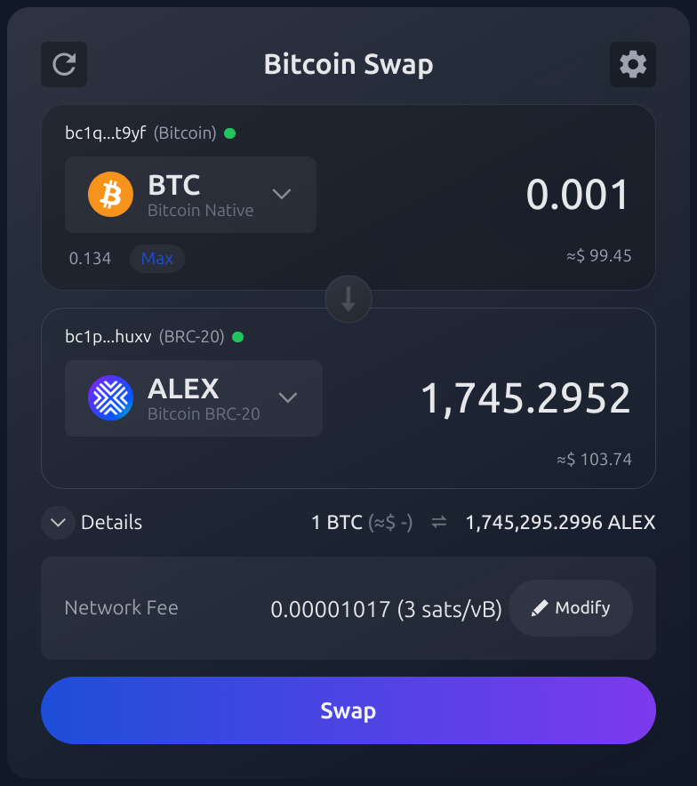
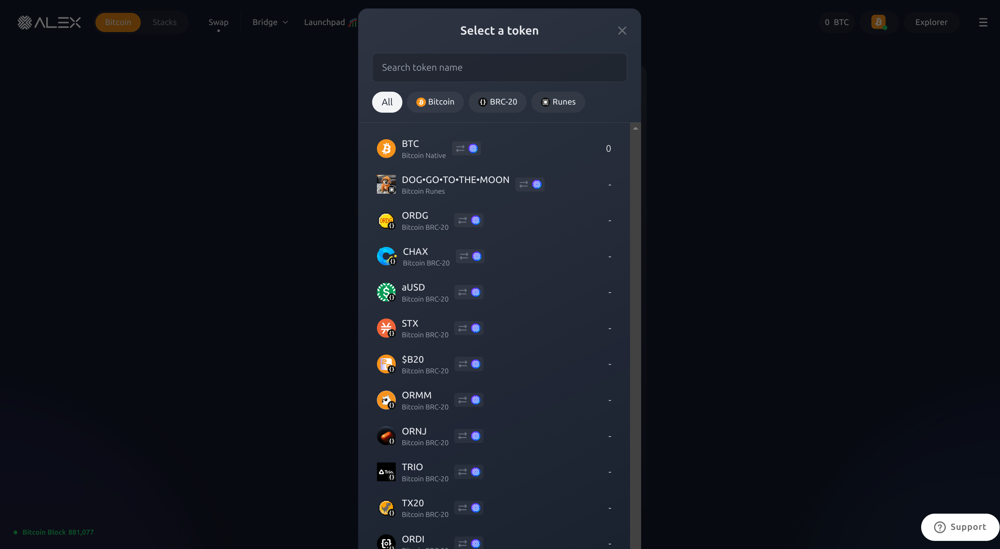
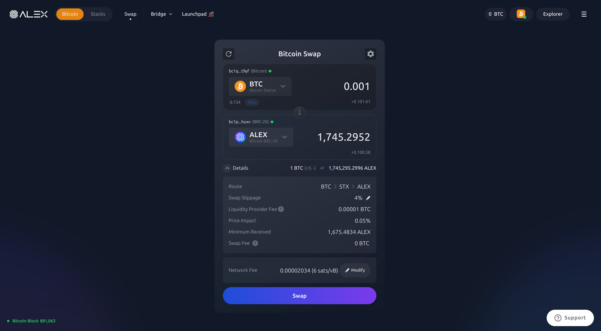
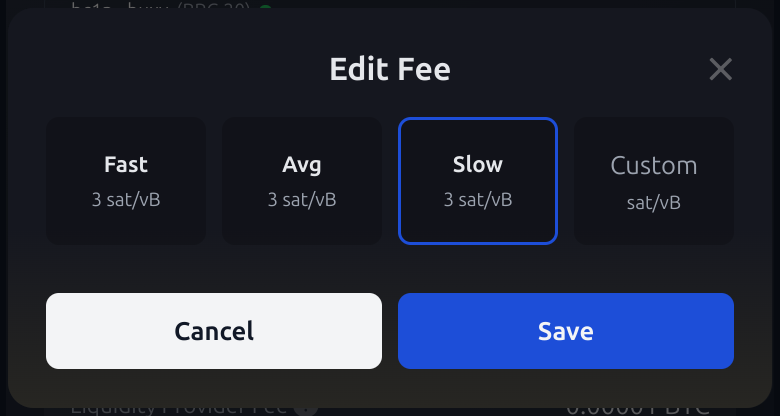
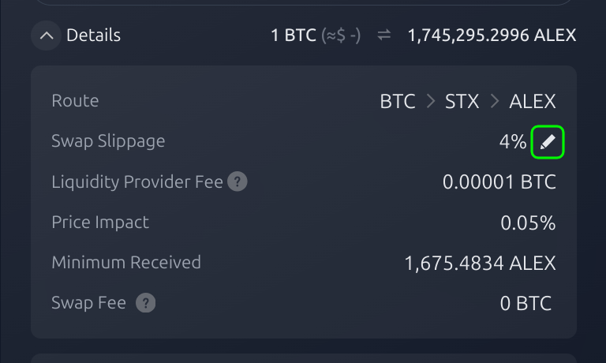
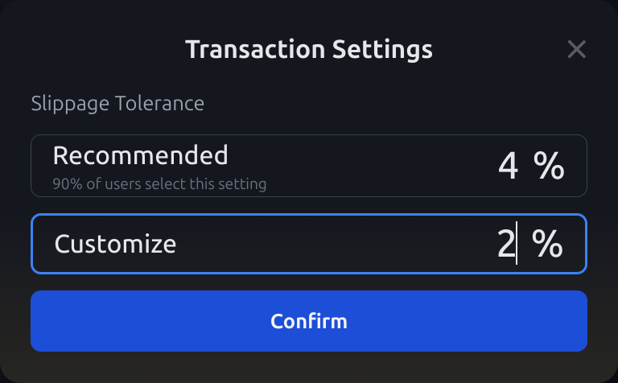

# 🧑‍🏫 How to Swap on Bitcoin

When performing a token swap, you transfer an amount of the token you want to exchange (base token) to the ALEX smart contract. In return, you receive a pre-agreed amount of the desired token (target token) from the ALEX smart contract, all within a single swap transaction. The resulting balance changes will be reflected in your wallet.

That said, let's get hands-on!

## :currency\_exchange: :moneybag: Trade One Token for Another

### Step 1: Head to the Bitcoin Swap Panel

Go to [https://app.alexlab.co/](https://app.alexlab.co/) to see the Swap panel. You can also navigate to it by clicking the `Swap` tab on the top menu bar. By default, the `Swap` section will be set to the Stacks Native Swap. For the **Bitcoin Native Swap**, select `Bitcoin` on the slider in the top left corner.

<figure><figcaption></figcaption>Swap tab</figure>

<figure><figcaption>Bitcoin Swap slider</figcaption></figure>

<figure><figcaption>Bitcoin Swap panel</figcaption></figure> 

### Step 2: Select Tokens and Amount

Select the tokens you want to exchange and enter the amount.

* The token at the top is the **base** token, the token you currently hold and want to exchange.
* The token below is the **quoted** or **target** token, the token you will receive in the trade.
* The dropdown arrow next to the token symbol will open the **token search** and **selection panel**.
* Below the amounts, you will find the current **exchange rate**, as well as the USD equivalent.
* The central down-pointing arrow shows the **direction of the transaction**. In the example below, BTC will be exchanged for ALEX. By clicking the arrow, you can quickly **invert** the order of the transaction: the base token becomes the quoted token and vice versa.

<figure><figcaption>
Example of the Bitcoin Swap panel
</figcaption></figure>


Clicking the `Max` button will automatically set the amount to your total available balance.


<figure><figcaption>
Token search and selection panel.
</figcaption></figure>

### Step 3: Check Transaction Details

#### Transaction Details

Check the transaction details by clicking the dropdown `Details` arrow below the amounts. This will expand a Details panel with relevant trading information.

<figure><figcaption>
Bitcoin Swap panel with Transaction Details panel expanded.
</figcaption></figure>

* **Route:** The exchange route to convert from the base token into the target token. In the example we see STX -> ALEX, indicating it is a one-step or direct swap. Bear in mind that some transactions may require intermediate swaps.
* **Swap Slippage:** The maximum percentage of price movement you'll accept between the time you submit the transaction and its execution. The default slippage tolerance setting is 4%, but you can select a custom percentage by clicking on the edit button. If price movement exceeds the slippage tolerance, the transaction will be reverted.
* **Liquidity Provider Fee:** The portion of the fee that is distributed between the Liquidity Providers (LPs) to incentivize them to continue providing liquidity.
* **Price Impact:** How much your swap affects the exchange rate.
* **Minimum Received:** The minimum amount of target token you will receive considering the maximum slippage variation. For example, if the Swap Slippage is set to the default value of 4% and you expect to receive 100 target tokens, the Minimum Received will be 96 target tokens.
* **Swap Fee:** The cost associated with performing a swap, excluding the Liquidity Provider Fee. It is deducted from the base token amount and it is distributed to the ALEX Lab Platform.

You can find more information on the aforementioned fields on the [Key Concepts Section](./key-concepts.md). 

Below the Details panel, you will see the **Network Fee**, which is the amount of tokens paid to the Bitcoin network to incentivize miners to continue validating transactions. You can set your preferred fee with the :pencil: "edit" button.

<figure><figcaption>
Edit Fee panel
</figcaption></figure>

#### Transaction Settings

If you want to adjust the **Swap Slippage**, select the "Edit" button to the right of the Swap Slippage field to open the **Transaction Settings** pop up. This will show a `Recommended` Slippage Tolerance, set at 4%, and an option to **Customize** the tolerance. Set your desired tolerance and click `Confirm`. This will determine your allowed range for price movement. Your transaction will revert if the price changes unfavourably by more than this percentage.

<figure><figcaption>Edit Swap Slippage button</figcaption></figure>

<figure><figcaption>
Transaction Settings panel example, with slippage tolerance set to 2%.
</figcaption></figure>

### Step 4: Confirm Transaction

Once you're ready to move ahead, select the `Swap` button which will bring up the Confirmation panel. This panel provides a final overview of your transaction details, allowing you to double-check price, route, fees and slippage. If everything looks good, click `Confirm` 😎.

### Step 5: Confirm Transaction in your Wallet

After clicking `Confirm`, you will need to confirm the transaction in your wallet. Here, your Bitcoin wallet is interacting with the ALEX smart contract and is asking you for approval. Scroll through the wallet transaction window, review it and confirm the transaction. By doing this, you are allowing the wallet to sign and broadcast the transaction.

### Step 6: Wait for Confirmation 

Wait for the transaction to be confirmed on the network.


Recommended to track transaction status:

* Turn on [Telegram notifications](https://t.me/stacks_tx_notification_bot), you will get notified when the transaction is confirmed.
* Search for the transaction on the [ALEX Explorer](https://app.alexlab.co/explorer).
* Check your address activity on the wallet.


### Step 7: Check the Updated Balance

Once the transaction is completed, you will see the balance updated in your wallet.

Thank you for successfully swapping on ALEX! :white\_check\_mark:
