# 🧑‍🏫 How to add liquidity

When **adding liquidity in DAMM**, you choose specific price ranges — called **bins** — where your assets will be active. This lets you focus your capital where you expect trading to happen, making it more efficient than traditional AMMs.

You’ll still provide an equivalent value of both tokens, and in return, receive LP tokens that represent your share of the selected bins.

Ready to start? Let's get hands-on!

### Step 1: Go to the Pool Page

Go to [https://app.alexlab.co/](https://app.alexlab.co/) and click on navbar's Swap -> ammv3 tab.

<figure><figcaption></figcaption></figure>

### Step 2: Select the Trading Pair

Once on the Pool page, you'll see the list of available trading pairs, such as STX-ALEX. This view shows each pair's combined **Total Value Locked (TVL)**, **24-hour trading volume**, and **average fee yield over TVL**.

<figure>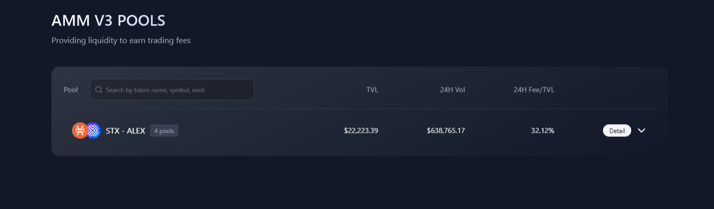<figcaption>
List of available trading pairs on DAMM pools.
</figcaption></figure>

Click on a trading pair (e.g. STX-ALEX) to reveal its associated bins.

### Step 3: Choose a Bin Step

After selecting a trading pair, the interface will expand to show multiple **Bin Steps**. Each bin step corresponds to a different price granularity:

- **Smaller Bin Step** (e.g. 1): Tighter price range, more control, ideal for stable or predictable prices.
- **Larger Bin Step** (e.g. 20): Wider price range, less concentration, potentially more uptime.

Each bin step has its own **liquidity**, **trading volume**, and **fee settings**. This gives you flexibility to choose the right strategy for your risk tolerance and expected market behavior.

<figure>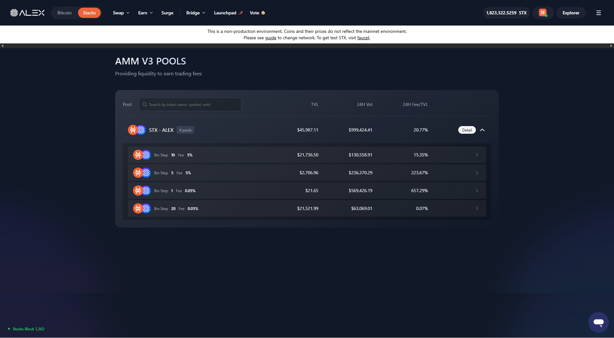<figcaption>
Selecting a bin step within the STX-ALEX pool.
</figcaption></figure>

Click on the bin you want to use. This will take you to the detailed interface where you can input token amounts and choose a price strategy.

### Step 4: View the Pool Control Panel

Once you’ve selected your desired bin, you'll be taken to the **Sub-pool view**. This is where you’ll configure your liquidity position.

The panel is divided into three sections:

- **Step 1: Enter amount** – Define how much of each token you want to deposit. The Auto Fill toggle helps calculate the second token’s amount automatically.
- **Step 2: Select strategy** – Choose between “Spot”, “Curve”, or “Customize” to define how many bins your liquidity should cover.
- **Step 3: Set price range** – The UI will calculate the price bounds and number of bins based on your selected strategy and token amounts.

<figure>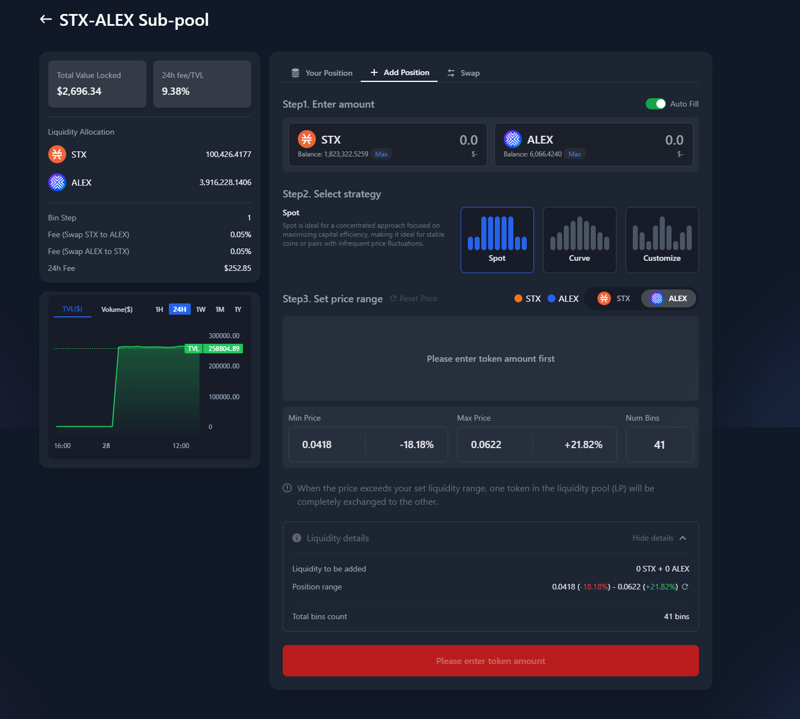</figure>

### Step 5: Enter Token Amounts

Enter the amount for one of the tokens (STX or ALEX). If “Auto Fill” is enabled, the app will automatically calculate the matching amount of the second token required for the liquidity position.

You’ll see the equivalent USD values underneath each amount for easy comparison.

<figure>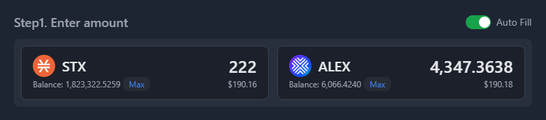</figure>

> **Note:** Clicking the **Max** button will fill in your entire balance for that token.

### Step 6: Select Strategy

DAMM offers three different strategies for providing liquidity: **Spot**, **Curve**, and **Customize**.  
Each one affects how your liquidity is distributed across price bins:

#### 🟦 Spot Strategy

Spot is the most straightforward strategy — it concentrates all your liquidity in a single bin around the current market price.

- Best for: Simple use cases, stable market conditions
- Liquidity is active only if price stays inside that bin
- Can provide higher APR if volume is high at that price level

<figure>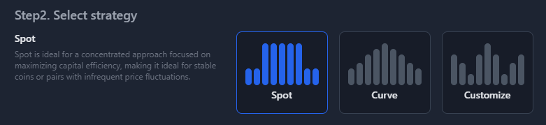<figcaption>
Spot Strategy selected.
</figcaption></figure>

#### 🟦 Curve Strategy

The Curve strategy spreads your liquidity over a range of bins, forming a symmetric curve around the current price.

- Best for: Moderate volatility or when you expect some price fluctuation
- Stays active over a wider price range
- More stable earnings over time

<figure>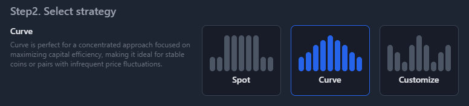<figcaption>
Curve Strategy selected.
</figcaption></figure>

#### 🟦 Customize Strategy

Customize gives you full control — you can manually select which bins to activate, how wide to spread your liquidity, and how much to assign to each.

- Best for: Advanced users who want to express specific market views
- Allows precise risk and capital allocation
- Useful for targeting known support/resistance levels

<figure>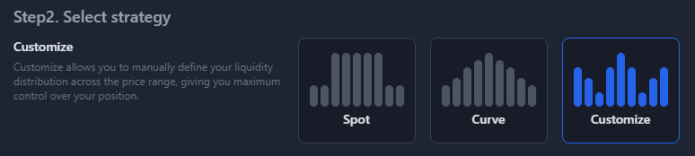<figcaption>
Customize Strategy selected.
</figcaption></figure>

Choose the strategy that fits your market outlook and risk appetite.  
Once selected, you’ll proceed to define the actual price range and bin configuration in the next step.

### Step 7: Set Price Range

Once you’ve chosen your strategy, you can define the exact **price range** in which your liquidity will be active.  
This is done by adjusting the **Min Price** and **Max Price** sliders. The range will determine which **bins** receive liquidity.

Each vertical bar in the chart represents a bin — a small price range where your funds will be allocated.  
The blue and orange colors indicate which token will dominate each bin, depending on current market conditions.

<figure>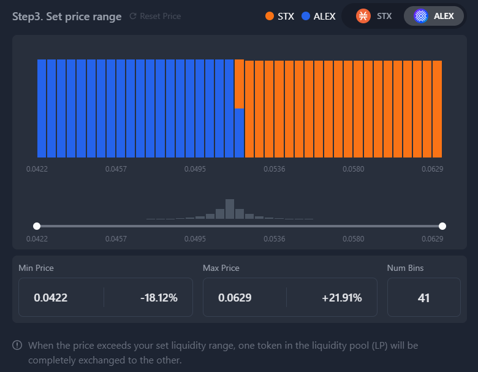<figcaption>
Price range selected for STX/ALEX pool, with 41 bins.
</figcaption></figure>

Below the chart you’ll see a summary:

- **Min Price / Max Price:** The boundaries of your active range.
- **% Deviation:** Shows how far each price is from the current market price.
- **Num Bins:** How many bins your liquidity will be spread across.

> 💡 The narrower your range, the more concentrated your liquidity — which can lead to higher APR but more risk if price moves away.


If the market price moves outside your set range, your position becomes inactive and stops earning fees.  
Also, your funds may become fully converted into one of the two tokens.


### Step 8: Confirm Liquidity Details and Add

Once you've set your price range, you'll see a **Liquidity details** panel summarizing your input:

- **Liquidity to be added:** The token amounts you're about to deposit into the pool.
- **Position range:** The price range over which your liquidity will be distributed.
- **Total bins count:** The number of bins where your liquidity will be placed.

<figure>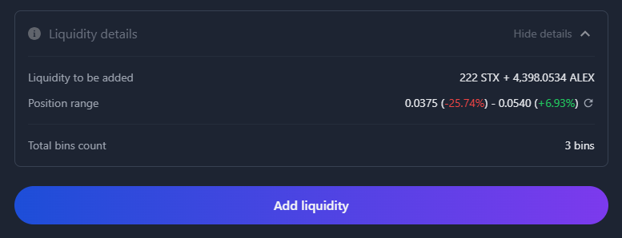<figcaption>
Liquidity preview: tokens, price range, and bin count.
</figcaption></figure>

Click **"Add Liquidity"** to proceed. This will prompt a wallet confirmation.

### Step 9: Confirm Transaction in Your Wallet

Your wallet will display the smart contract function being called — `add-to-positions-many` — along with the parameters: token contracts, pool ID, and tick information.

Carefully review:

- **Tokens and amounts** being sent.
- The **tick data** showing how your liquidity is distributed.
- The smart contract origin (**should be ALEX**).

<figure>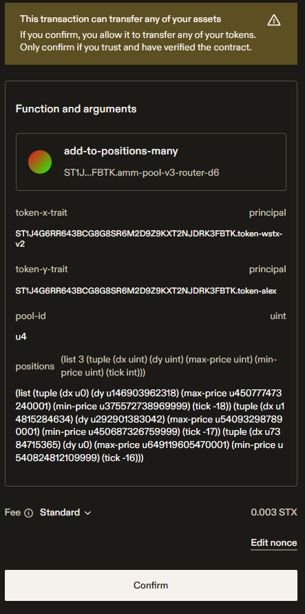<figcaption>
Stacks wallet confirmation screen for adding DAMM liquidity.
</figcaption></figure>

When you're ready, click **"Confirm"** in your wallet to broadcast the transaction.

Once submitted, you will see a success message on the interface if the transaction is confirmed.

<figure><figcaption>
Successful transaction notification on ALEX interface.
</figcaption></figure>

### Step 10: Check Your Position

Once the transaction is confirmed, your new liquidity position will appear in the **Your Position** tab of the sub-pool.

Here, you’ll see a breakdown of:

- **Total Liquidity** (USD equivalent)
- **Current Balance** vs **Initial Balance** — helpful to track fees earned
- **Position Detail**, showing:
  - The price bins your liquidity is distributed across
  - The 24h Fee/TVL (APR per bin)
  - Your liquidity value per price range

You can also monitor how your liquidity is performing across active and inactive bins.

<figure>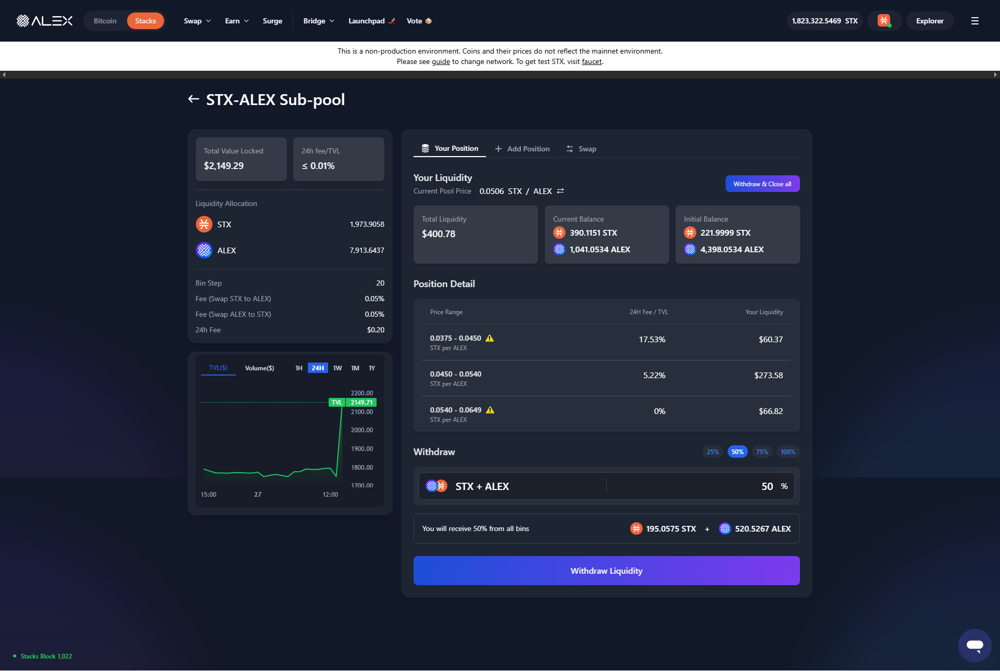<figcaption>
Your Position shows bin-by-bin allocation, fee performance, and withdrawal options.
</figcaption></figure>