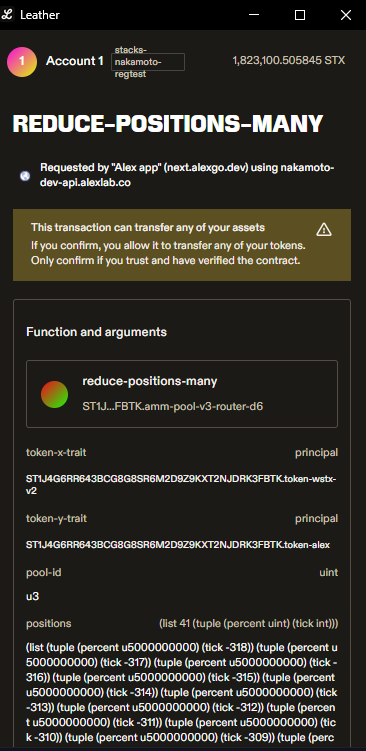
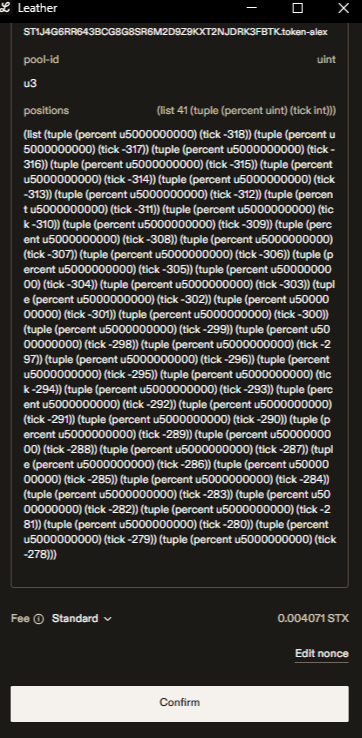

# 🧑‍🏫 How to remove liquidity

When **removing liquidity** in DAMM, you're closing your selected price bins and reclaiming the tokens you originally allocated to them.  
Depending on how the market price moved during the time your bins were active, you may receive:

- a mix of both tokens (if the price stayed inside your range), or  
- only one token (if the price exited the range and your liquidity was fully converted to the other side).

In both cases, the withdrawn amount includes any **fees accrued** while your bins were active.

Since the relative balance of tokens can shift based on price action, you might experience what’s known as [Impermanent Loss](key-concepts.md#impermanent-loss) — especially when withdrawing after major market moves.

Ready to start? Let's get hands-on!

### Step 1: Go to the Pool Page

Go to [https://app.alexlab.co/](https://app.alexlab.co/) and click on the navbar’s **Swap → ammv3** tab.

<!-- <figure><figcaption></figcaption></figure> -->

### Step 2: Select the Trading Pair

On the Pool page, locate the **trading pair** (e.g. STX-ALEX) where you’ve added liquidity.

Each entry shows:

- **TVL (Total Value Locked)**: Combined liquidity in that pair.
- **24H Volume**: Total trading volume over the last 24 hours.
- **Fee Yield**: LP fee returns based on recent activity.

<figure><figcaption>
Locate the pair where you’ve previously added liquidity.
</figcaption></figure>

Click the row to expand its bin steps and proceed.

### Step 3: Choose the Bin Step You Used

After selecting the pair, the interface will display the available **Bin Steps**.  
To remove liquidity, you must select the **same bin step** where your position was originally added.

Each bin step operates independently — your position is **only visible inside the bin step where it was added**.

<figure><figcaption>
Select the bin step where your active position exists.
</figcaption></figure>

Click your bin step to view and manage your current position.

### Step 4: View Your Position and Prepare Withdrawal

Once inside the selected **Bin Step**, the app will display your current position under the **"Your Position"** tab.

This screen includes:

- **Your Liquidity**: Current balances and initial deposit values.
- **Position Detail**: Shows the price bins where your liquidity is active or inactive.
- **Withdraw Panel**: Where you choose how much of your position to withdraw (25%, 50%, 75%, or 100%).

<figure><figcaption>
Example of a live position in STX-ALEX bin step 20.
</figcaption></figure>

You have two options:

- Use the **Withdraw panel** to remove a portion (or all) of your liquidity.
- Click **"Withdraw & Close all"** to remove 100% and close your position entirely.

Select the percentage you want to withdraw. The expected return in each token (STX and ALEX) will be shown below.

### Step 5: Confirm Withdrawal

Once you've chosen how much liquidity you want to withdraw (25%, 50%, 75%, or 100%), click the **"Withdraw Liquidity"** button.

This action will remove your position from the selected bin(s), and return the corresponding tokens (STX and ALEX) to your wallet. The exact amount you receive depends on where the market price was while your liquidity was active:

- If the price stayed within your selected range, you'll get back **both tokens**.
- If the price moved outside your range, your liquidity may have been converted, so you might receive **mostly one token**.

After clicking the button, your wallet will open and show a transaction to approve. This is the confirmation step before the withdrawal is processed.

  <figure>
    
    <figcaption>
Wallet screen showing reduce-positions-many function.
</figcaption>
  </figure>
  <figure>
    
    <figcaption>
Withdrawal distribution across multiple bins.
</figcaption>
  </figure>

Once confirmed, a “Transaction Mining...” status will appear in the app interface.

<figure><figcaption>
Pending transaction indicator after confirming withdrawal.
</figcaption></figure>

### Step 6: Wait for Transaction Confirmation

Once the withdrawal transaction is submitted, it may take a few moments for the network to process and confirm it.

<!-- [placeholder for a "Transaction Successful" screenshot] -->

After confirmation, the tokens you withdrew, either a mix of STX and ALEX, or a single token depending on how your liquidity was positioned, will be returned to your wallet.

You can verify the transaction status using:

- The **notification banner** in the ALEX interface.
- A blockchain explorer such as [ALEX Explorer](https://app.alexlab.co/explorer).
- Your wallet’s transaction history.

Once confirmed:

- The **Withdrawn percentage** will be deducted from your position.
- The **My Liquidity** panel will reflect the updated token balances.
- If you withdrew 100%, your position will be fully removed from the interface.