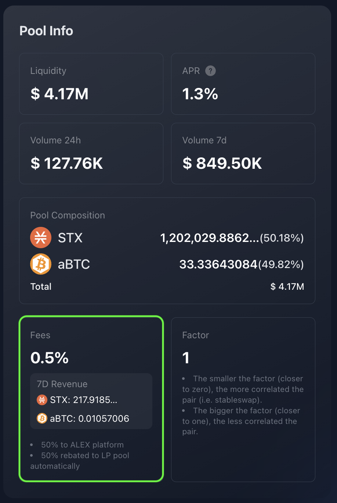

# FAQs

## Liquidity Pools & Providers

What is the difference between swap fee and fee rebate?

The **swap fee** is the total fee charged to users for executing a token swap. It's the fee that directly impacts the trader and is displayed as "Fees" in the Pool Info panel.

On the other hand, the **fee rebate** is the portion of the swap fee that is distributed to liquidity providers as a reward for supplying liquidity to the pool. The remaining portion of the swap fee goes to the ALEX Lab Foundation. You can also find the fee rebate percentage in the Pool Info panel.

What is the swap fee percentage that goes to liquidity providers?

The swap fee percentage that goes to liquidity providers is known as the **fee rebate**. It is typically set at 50% of the swap fee, though it can vary depending on the pool. You can check this percentage in the Pool Info panel.

What are the LP Tokens?

Also know as "Pool Tokens", these tokens are issued to liquidity providers to represent their share of the liquidity pool. The total supply of LP tokens represents the 100% of the pool's funds.

When users add liquidity to a pool, they receive LP tokens as proof of ownership. These tokens entitle them to a proportional share of the pooled assets and a portion of the fees generated by trades (swaps) within the pool.

When liquidity is removed, the user transfers LP tokens back to the protocol. This determines how much of the pool's assets are returned to the user, along with their share of the transaction fees accrued during the time their liquidity was provided.

How does the fee rebate benefit liquidity providers?

The fee rebate is automatically accrued and reinvested into the pool, increasing the overall value of the pool. Since liquidity providers (LPs) hold a share of the pool, their holdings grow in value over time. However, these rewards can only be claimed when LP tokens (representing their share of liquidity) are withdrawn from the pool.

How are fees transferred to the liquidity provider's wallet?

The fees are not directly transferred to the liquidity provider's (LP) wallet. Instead, the swap fees allocated to LPs are accrued and reinvested into the liquidity pool. By holding LP tokens, liquidity providers accumulate their share of the fees over time. These accrued fees become available when they withdraw funds from the pool (i.e. when they remove liquidity). At that point, LP tokens are transferred back to the protocol, and in return, the provider receives their corresponding share of the pool's funds, including the accumulated fees.

Where can I see the fees I've gained so far as a liquidity provider?

While there isn't a direct way to view your fees separately, you can check the "My Liquidity" panel for this purpose, which shows your LP tokens and liquidity provision details. To access it, navigate to the Swap -> Pool tab and select your pool of interest from the list. You'll also see a summarized version above the pool list.

In this panel, the **Pooled** amount reflects your total token holdings in the liquidity pool, which includes both your initial deposit and any fees you've accrued. Over time, this amount increases as more fees are added. The **Indicative Value** shows the USD equivalent of your holdings, which may fluctuate due to price changes of the pool's assets, but still provides a useful reference for tracking your gains.

How is liquidity provision related to farming?

Liquidity providers can stake or lock up their LP tokens for a fixed period of time (a selected number of ALEX cycles) to earn additional rewards. These rewards are separate from the earnings generated through liquidity provision, that come from swap operations fees (trading fees). This process is known as Yield Farming, or simply 'Farming'. For more details, explore the [ALEX Farming](../farm.md) feature.

Can I remove liquidity at any time?

Yes, you can remove liquidity at any time. However, if you've staked your LP tokens for farming, you won't be able to withdraw them until the staking period has ended.

How does impermanent loss happen?

Let's walk through an example of how impermanent loss might look for a liquidity provider (LP).

Carol deposits 100 [STX](https://www.coingecko.com/en/coins/stacks) and 150 [sUSDT](https://www.coingecko.com/en/coins/bridged-tether-alex-bridge) into a liquidity pool. As with ALEX DEX's AMM, the deposited token pair must to be of equivalent value. This means that the price of STX is 1.5 sUSDT at the time of deposit, making Carol's total deposit worth 300 USD.

Now, let's assume the total pool size is 1,000 STX and 1,500 sUSDT, funded by Carol and other LPs. So Carol has a 10% share of the pool.

Next, suppose the price of STX rises to 6 sUSDT. As this happens, arbitrage traders will add sUSDT to the pool and remove STX, adjusting the balances to reflect the new market price. Since AMMs don't use order books, the asset's price in the pool is determined by the ratio between their balances.

With the price change–STX is now 6 sUSDT– the pool now holds 500 STX and 3,000 sUSDT, thanks to the work of arbitrage traders.

So, Carol decides to withdraw her funds. As we know from earlier, she's entitled to a 10% share of the pool. As a result, she can withdraw 50 STX and 300 sUSDT, which now totals 600 USD. At first glance, it looks like she's made a good profit on her initial 300 USD deposit, right?

However, if Carol had simply held onto her 100 STX and 150 sUSDT, their combined value would now be 750 USD.

This shows that Carol would have been better off holding her assets instead of providing liquidity. This is impermanent loss. With that said, this example doesn't account for the trading fees Carol would have earned as a liquidity provider, which could potentially offset or even exceed the loss, making liquidity provision profitable overall.

Can I create my own pool?

Yes! [Self-Service Listing](../self-service-listing.md) allows you to create your own trading pool on ALEX DEX. This feature lets you list your token for permissionless trading against an anchor token, typically one with a stable value, providing a reliable reference point for pricing your token.

## Self-Service Listing

Which are the anchor tokens supported?

Native STX token, ALEX token and aBTC token.

Is there a minimum liquidity amount for the anchor token?

Yes. Initial liquidity of the anchor token must be a minimum of 1,800 STX or the equivalent value in ALEX or aBTC tokens.

How is the listed token initial price determined?

The initial price is determined by the initial liquidity provided by the creator. The ratio between the pair of funds determines the price relationship between both tokens. 

For instance, if the creator provides 8,000 listing tokens and 2,000 anchor tokens, that means the initial ratio is 4:1. Note that pool ratios are calculated as the minimal expression of the fraction between the token balances. In this case, is 8,000 / 2,000.

We can think of this initial ratio in two ways (and they are both equivalent):

- 4 listing tokens equals 1 anchor token.
- 1 listing token equals 0.25 anchor tokens.

How does the price of the listing token change once the pool is created?

Once the pool is created, the price discovery phase begins. Users can permissionlessly trade the pair of assets, and the [Automated Market Maker (AMM)](../../detailed-information/alexs-automated-market-maker-amm.md) algorithm will determine the price dynamics of the newly listed token. For further information on this topic please refer to the [ALEXGo Trading Pool documentation](https://docs.alexgo.io/automated-market-making/trading-pool).

Is there some requirement to make the listed token visible on <a href="https://app.alexlab.co/token-list">ALEX Token List</a>?

Yes. ALEX requires a [Coingecko](https://www.coingecko.com/) or [CoinMarketCap](https://coinmarketcap.com/) token listing to verify the provided social media information before uploading it to the official list at [app.alexlab.co/token-list](https://app.alexlab.co/token-list).

Once that is done, click on `Customer Support` on the [Self-Service Listing page](https://app.alexlab.co/self-service-listing) or contact us via Telegram at [t.me/ALEXselfservice ](https://t.me/ALEXselfservice) to submit your information (e.g. X accont, Discord, official website).

What is a wrapped version of a token contract?

Wrapped token contracts refer to "pass-through" tokens that don't retain economics; their purpose is to simplify development and enhance security. ALEX is responsible for deploying wrapped contracts. As its primarily technical, it is not relevant from a user perspective other than it involves a whole step in the procedure and takes some time.

