# 🧑‍🏫 How to remove liquidity

When **removing liquidity**, you will transfer your LP tokens back to the ALEX smart contract and withdraw an equivalent value of the token pair plus any fees accrued while holding those LP tokens. Since the relative balance of the tokens in the liquidity pool may have changed since your initial deposit, you could experience what's known as [Impermanent Loss](key-concepts.md#impermanent-loss).

Ready to start? Let's get hands-on!

### Step 1

As when adding liquidity, go to [https://app.alexlab.co/](https://app.alexlab.co/) and click on navbar's Swap -> Pool tab.

<figure>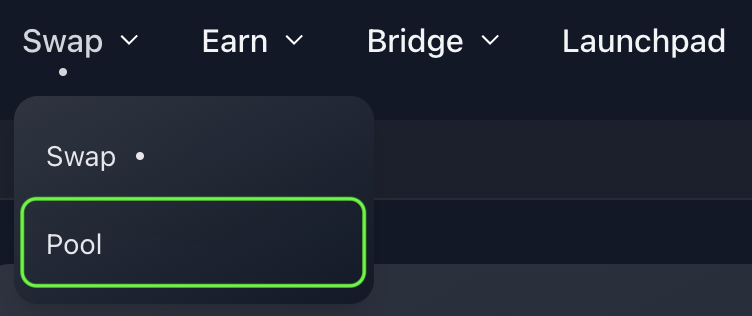<figcaption></figcaption></figure>

Once you're on the Pool page, you'll find the "My Liquidity" panel at the top of the pool list. This panel provides a summary of all your pool contributions.

<figure>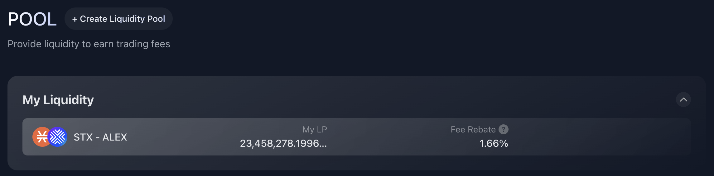<figcaption>
The pools where you are providing liquidity are displayed here. There is only one in this example.
</figcaption></figure>

### Step 2

Select the pool you would like to remove liquidity from, either through the "My Liquidity" panel or directly from the pool list.

<figure>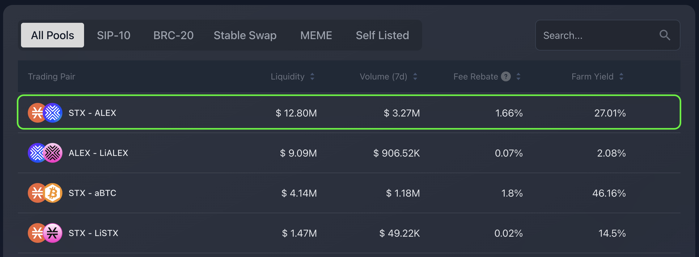<figcaption>
STX-ALEX pool selection.
</figcaption></figure>

### Step 3

Once in the panel of the pool, select the "Remove Liquidity" tab.

<figure>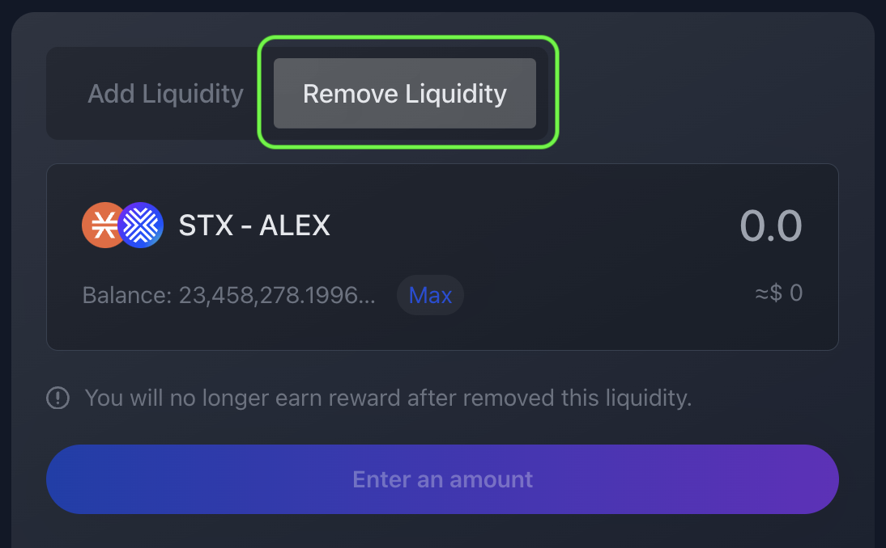<figcaption></figcaption></figure>

### Step 4

For this step, it's important to have in mind that the LP tokens you hold represent your share of the pool's funds. By entering the LP token amount, you're specifying the portion of the pooled funds you want to withdraw. Clicking the "Max" button sets your entire LP token balance, indicating you want to remove all liquidity from the pool.

When you enter the amount of LP tokens, you are specifiyng amount you will transfer to ALEX smart contract in order to receive your funds and any accrued fees in return. These fees are the ones accrued while holding those LP tokens.

Once you have decided the LP token amount, click the "Remove" button.

<figure>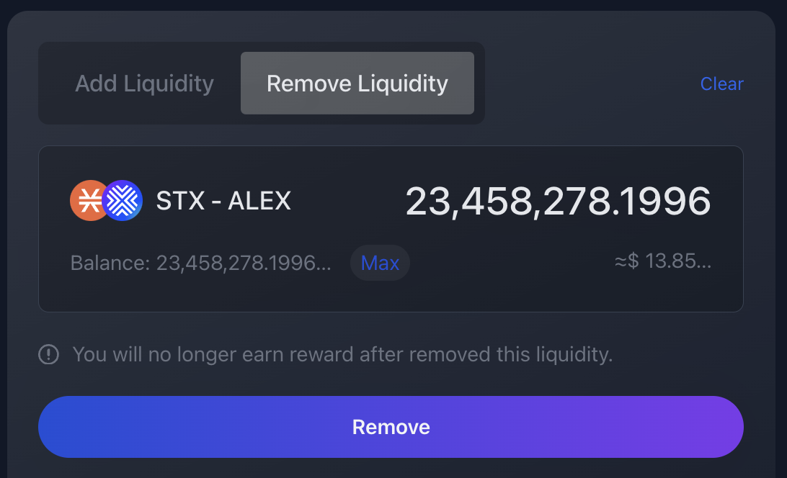<figcaption>
Example of removing all liquidity; the amount matches the LP token balance.
</figcaption></figure>

### Step 5

A confirmation panel will appear where you can double check the amount. If everything looks correct, click "Confirm" :sunglasses:

<figure>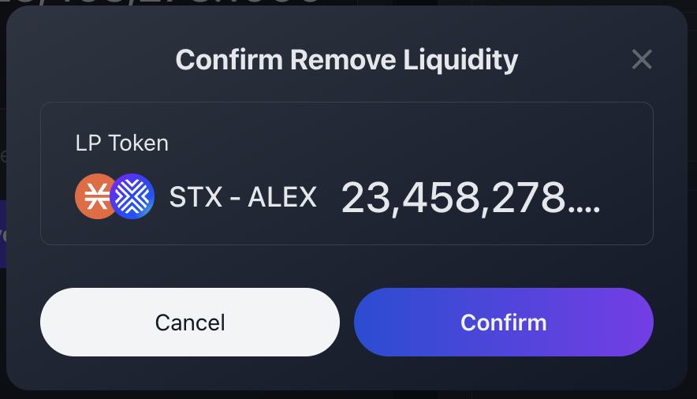<figcaption></figcaption></figure>

### Step 6

After clicking "Confirm", you will need to confirm the transaction in your wallet. Here, your Stacks wallet is interacting with ALEX smart contract and is asking you for approval. Scroll through the wallet transaction window, review it and confirm the transaction. By doing this, you are allowing the wallet to sign and broadcast the transaction.

<figure>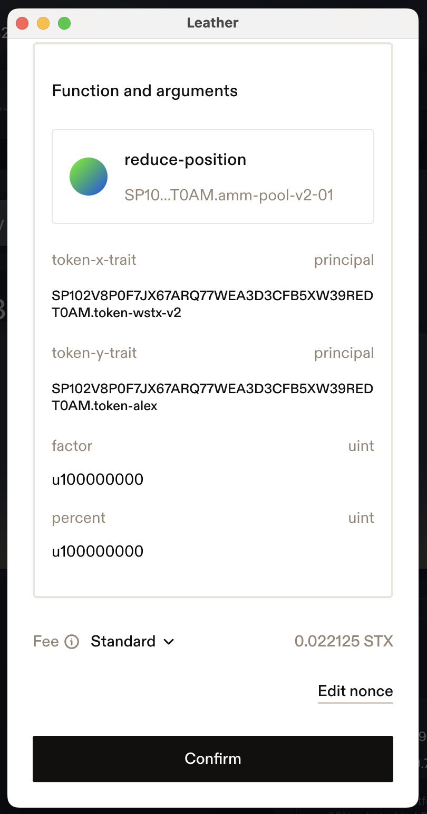<figcaption>
Function arguments and confirmation button.
</figcaption></figure>

### Step 7

Wait for the transaction to be confirmed on the network.

<figure>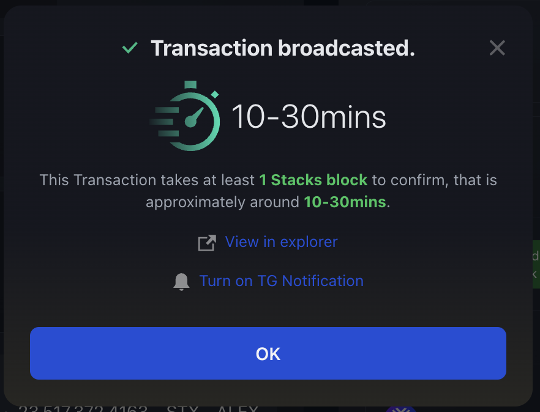<figcaption></figcaption></figure>


Recommended to track transaction status:

* Turn on [Telegram notifications](https://t.me/stacks_tx_notification_bot), you will get notified when the transaction is confirmed.
* Search for the transaction on the [ALEX Explorer](https://app.alexlab.co/explorer).
* Check your address activity on the wallet.


<figure>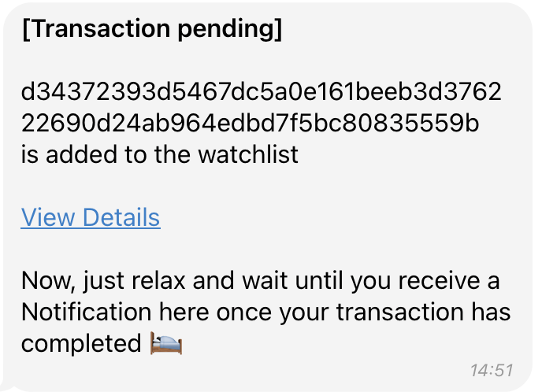<figcaption>
Telegram message with transaction pending status.
</figcaption></figure> <figure>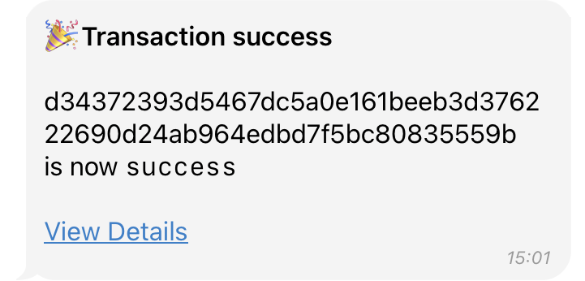<figcaption>
Telegram message with transaction success status.
</figcaption></figure>

<figure>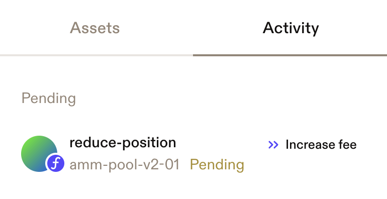<figcaption>
Transaction pending displayed on Leather wallet.
</figcaption></figure> <figure>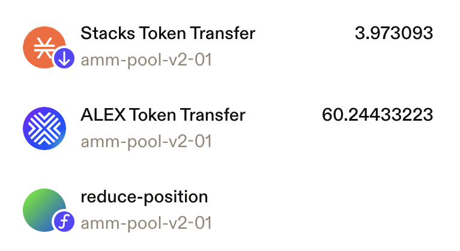<figcaption>
Transaction completed, token transfers are visible.
</figcaption></figure>

### Step 8

Once the transaction is completed, you will see the changes reflected in the "My Liquidity" panel, and the updated token balances should appear in your wallet.

<figure>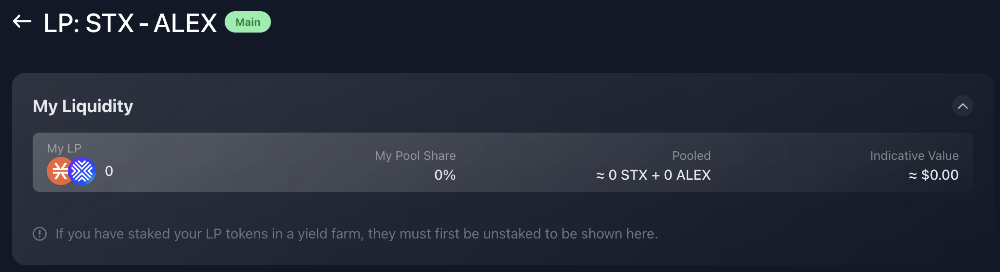<figcaption></figcaption></figure>

[^1]: The APR metric is the same as the displayed in the Fee Rebate column on the previous step.
