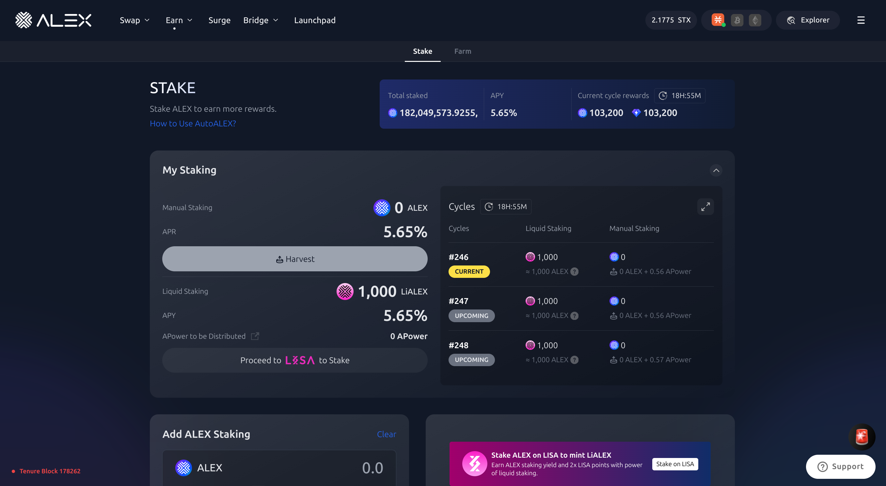

## 💧 Liquid Staking (Auto Staking)

Once your first staking cycle has concluded, you will have the option to continue earning rewards via **Liquid Staking**. Liquid Staking allows you to earn rewards while maintaining liquidity as you receive LiALEX in exchange for your stake. You can start liquid staking directly from the [LISA Lab Homepage](https://app.lisalab.io/li/alex/staking), or from the [ALEX Lab Homepage](https://app.alexlab.co/stake) if you've manually staked before. This section explains how to start liquid staking your rewards from manual staking. For more information, you can refer to the [Key Concepts](key-concepts.md) section.

### Step 1: Check My Staking

Head to the [Stake page](https://app.alexlab.co/stake), or, alternatively, click on the navbar's `Earn` -> `Stake` tab from the [ALEX Labs homepage](https://app.alexlab.co).

Once you're on the Stake page, you'll find the **My Staking** panel, which displays your current stake. 

### Step 2: Auto Stake Your Principal and Your Rewards

If a cycle has ended and you can claim rewards, you will see the amount of claimable $ALEX and APower on the `Harvest` button. If you have no rewards to claim yet, the `Harvest` button will be greyed out. 

Below the button, you will see the `Auto Stake` slider. Click on it if you wish to proceed to Liquid Staking and receive LiALEX in exchange for staking your rewards.

Bear in mind that, if your staking period has ended, `Auto Stake` will also stake your **Principal** (your original $ALEX stake) rather than just your rewards. It is not possible to auto stake only a portion of your principal or your rewards.

With the `Auto Stake` slider in green, click on the `Harvest` button to stake your rewards.

<figure><figcaption>Selected Auto Stake in "My Staking"</figcaption></figure>

### Step 3: Confirm Auto Stake

A confirmation panel will appear where you can double check the amount. If everything looks correct, click `Confirm`.

<figure><figcaption>

</figcaption></figure>

#### Confirm Harvest

* **Harvest:** The amount of staked $ALEX that will be auto staked and the amount of APower that you have earned by staking. &#x20;
* **Auto Stake (receive):** The amount of LiALEX tokens you will receive in exchange for continuing to stake your $ALEX. This allows you the benefit of maintaining liquidity while continuing to earn staking rewards.
* **Stake Price:** The price of LiALEX relative to $ALEX.
* **Total Claim:** The amount of LiALEX and APower that will be transferred to your wallet. Your ALEX tokens will continue being staked.

### Step 4: Confirm Transaction

After clicking `Confirm`, you will need to confirm the transaction in your wallet.

Here, your Stacks wallet is interacting with the ALEX smart contract and is asking you for approval. Scroll through the wallet transaction window, review it and confirm the transaction. By doing this, you are allowing the wallet to sign and broadcast the transaction.

<figure><figcaption>
Transaction preview displayed on Leather wallet
</figcaption></figure>

<figure><figcaption>
Function arguments and confirmation button
</figcaption></figure>

### Step 5: Confirm Transaction on Your Wallet

Wait for the transaction to be confirmed on the network.

Your LiALEX could take between 20-40 minutes to appear on the [Stake page](https://app.alexlab.co/stake), but once the transaction is confirmed on the ALEX network, you will be able to see your staked tokens in the **My Staking** section.

<figure><figcaption>Your LiALEX in "My Staking"</figcaption></figure>

Note that Liquid Staking does not have a cooldown period, meaning your tokens start earning rewards from the current cycle onward. For more information, please refer to the [Staking FAQs](./faqs.md).


Recommended to track transaction status:

* Turn on [Telegram notifications](https://t.me/stacks\_tx\_notification\_bot), you will get notified when the transaction is confirmed.
* Search for the transaction on the [ALEX Explorer](https://app.alexlab.co/explorer).
* Check your address activity on the wallet.


<figure><figcaption>
Telegram message with transaction pending status.
</figcaption></figure>

<figure><figcaption>
Telegram message with transaction success status.
</figcaption></figure>

