# How to stake on ALEX

Staking on ALEX requires a few easy steps. In short, it consists of locking up your tokens temporarily to earn rewards. In staking, time is measured in cycles, and at the end of each cycle, you will be able to harvest your rewards. At that point, you may choose to transfer rewards to your wallet or to proceed to Liquid Staking with LiALEX.

## :anchor: Staking Your $ALEX

#### Step 1: Connect Stacks Wallet

If you haven't already, the first step is to connect your wallet to ALEX. Go to the [Stake page](https://app.alexlab.co/stake) and under the **My Staking** section, press the `Connect stacks wallet` button. After performing the corresponding validation, **My Staking** will display. 

You can always change your wallet configuration from the `Wallet Manager` in the top right corner.

<figure>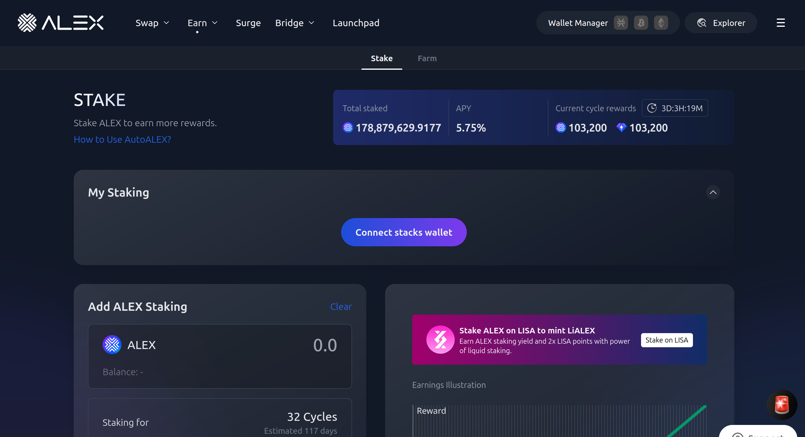<figcaption>Stake homepage</figcaption></figure>

#### Step 2: My Staking

In **My Staking**, "Manual Staking" will indicate how much ALEX you're currently staking, along with its estimated Annual Percentage Rate (APR). Bear in mind that, unlike Annual Percentage Yield (APY), APR doesn't take into account the compounding effect of rewards.

On the right-hand side of **My Staking**, you will see the "Cycles" section, which indicates how much time is left for the upcoming cycle, as well as the number of the current one. You can expand this section to display "All Cycles." The timer indicates how much time is left of the current cycle. Bear in mind that your tokens will be staked on the upcoming cycle for the first time.

<figure>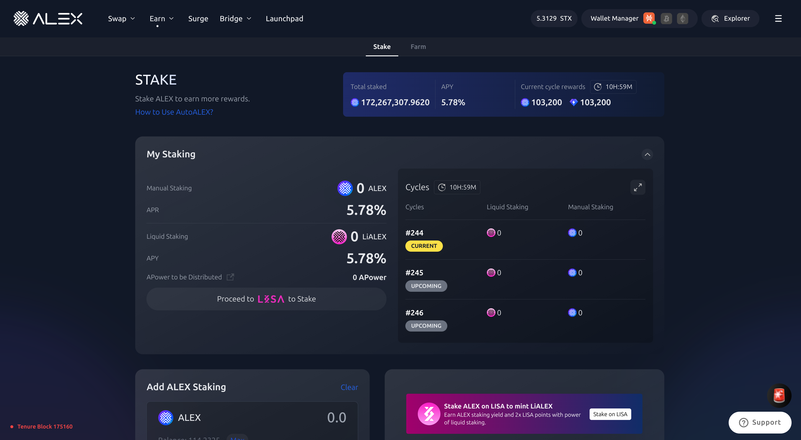<figcaption>"My Staking" panel</figcaption></figure>

##### Staking Metrics

* **Manual Staking:** The amount of $ALEX you are currently staking.&#x20;
* **APR:** The Annual Percentage Rate of your investment. It is the interest you would earn by staking for one year.
* **Liquid Staking:** The amount of $ALEX you are currently staking through LISA.
* **APY:** The Annual Percentage Yield of your investment. It is the interest you would earn by staking for one year, including compounding interest from re-staking your rewards.
* **APower to be Distributed:** The amount of APower you will earn as a result of your investment.

##### Cycles

* **Cycles:** The number of the current cycle, as well as the numbers of the two upcoming cycles.
* **Liquid Staking:** The amount of $ALEX you will be staking through LISA for each cycle as a result of your investments so far. 
* **Manual Staking:** The amount of $ALEX you will be manually staking for each cycle as a result of your investments so far.

By pressing `Proceed to LISA to Stake` you will open the dashboard for liquid staking on LISA. For more information, you can consult the [LISA Staking Guide](https://docs.lisalab.io/features-how-tos/staking-stacking).

Once you've verified your current balances, APR, APY and cycle timing, you can proceed to the next step.

#### Step 3: Add ALEX Staking

Select how much $ALEX you wish to stake and for how long. You can use the slider to personalize the amount of cycles, and you will see an estimate of how many days the selected amount of cycles will last. If you wish to stake ALEX tokens for different periods of time, you will need to execute two transactions. For example, if you wish to stake 100 ALEX for 8 cycles and 80 ALEX for 24 cycles, you will need to follow these steps twice. 

<figure>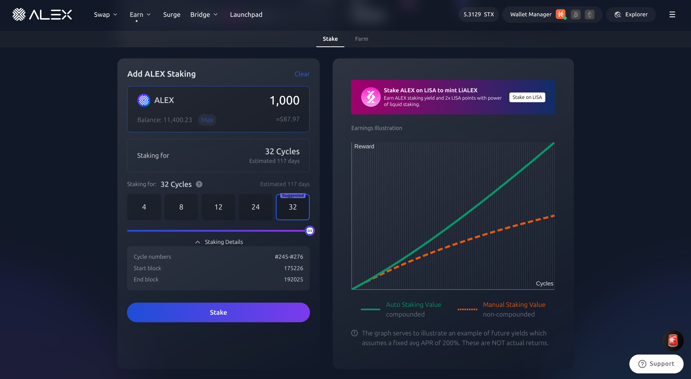<figcaption>"Add ALEX Staking" panel</figcaption></figure>

The `MAX` button will stake your entire balance.

In `Staking Details` you can see the numbers of the cycles you'll be staking for under your current settings, along with the corresponding "Start" and "End" blocks on the Stacks network. Afterwards, click `Stake` to begin staking.

#### Step 4: Confirm Staking

You will be prompted to confirm that the selected settings are correct. Please verify the information on the pop-up window and press `Confirm` to continue.

<figure>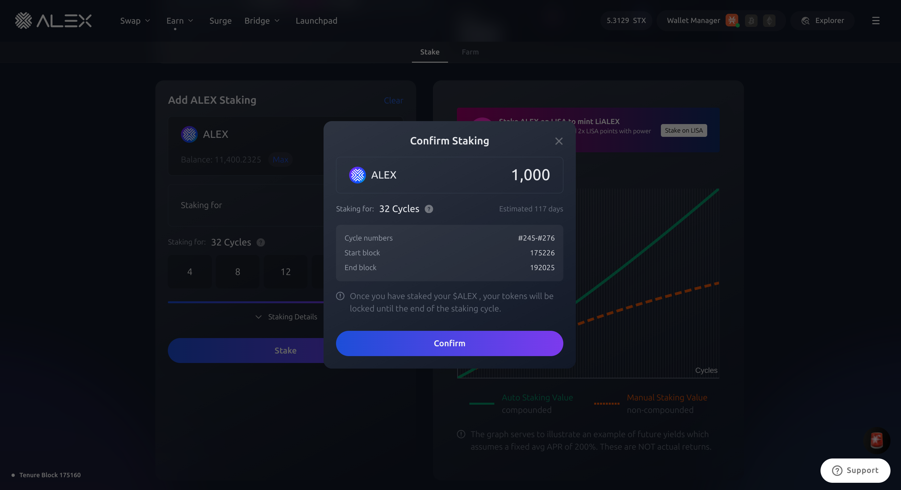<figcaption></figcaption></figure>

#### Step 5: Confirm Transaction on Your Wallet

Your Stacks wallet will ask you to confirm the transaction. After that, wait for your transaction to be confirmed on the network.

<figure><figcaption>
Wallet pop-up with function arguments and confirmation button.
</figcaption></figure>

A `Transaction Mining...` pop-up should appear on the top right corner of your screen, followed by `Transaction Successful` a few moments later. 

#### Step 6: Check Transaction Status

Wait for the transaction to be confirmed on the network. 

Your staked tokens could take between 20-40 minutes to appear on the [Stake page](https://app.alexlab.co/stake), but once the transaction is confirmed on the ALEX network, you will be able to see your staked tokens in the **My Staking** section.

<figure>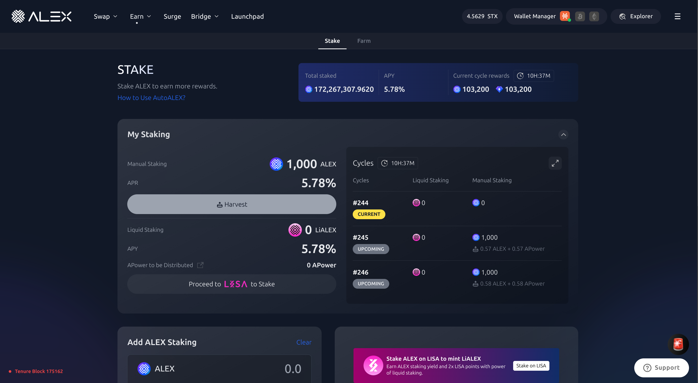<figcaption></figcaption></figure>


Recommended to track transaction status:

* Turn on [Telegram notifications](https://t.me/stacks\_tx\_notification\_bot), you will get notified when the transaction is confirmed.
* Search for the transaction on the [ALEX Explorer](https://app.alexlab.co/explorer).
* Check your address activity on the wallet.


## :moneybag: Harvesting Your Staking Rewards

Once your first staking cycle ends, you will be able to start harvesting your rewards. At this point, you can choose to transfer your rewards to your wallet via [Manual Staking](how-to#claim-rewards-manual-staking) or to [Auto-Stake](how-to.md#auto-stake-liquid-staking) them with $LiALEX.

### Claim Rewards (Manual Staking)

#### Step 1: Check My Staking

As when staking, go to the [Stake page](https://app.alexlab.co/stake), or, alternatively, click on the navbar's `Earn` -> `Stake` tab from the [ALEX Labs homepage](https://app.alexlab.co).

Once you're on the Stake page, you'll find the **My Staking** panel, which displays your current stake. 

#### Step 2: Harvest Your Principal & Your Rewards

If a cycle has ended and you can claim rewards, you will see your $ALEX and APower on the `Harvest` button. If you have no rewards to claim yet, `Harvest` will be greyed out. The button will also display the amount of $ALEX and APower that are available for harvesting.

Bear in mind that, if your staking period has ended, harvesting will also transfer your **Principal** (your staked $ALEX), to your wallet. It is not possible to collect only a portion of your principal or your rewards.

Click on the `Harvest` button to claim your rewards.

<figure><figcaption>

</figcaption></figure>

#### Step 3: Confirm Harvest

A confirmation panel will appear where you can double check the amount. If everything looks correct, click `Confirm`.

<figure>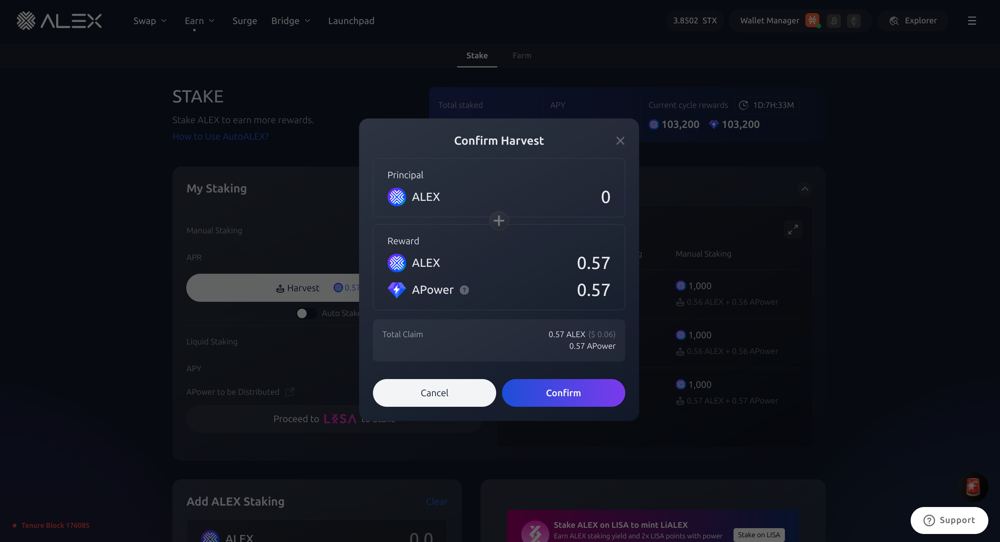<figcaption>

</figcaption></figure>

##### Confirm harvest

* **Principal:** This is the amount of staked $ALEX that is no longer locked-up and can be transferred to your wallet. If you've staked 100 ALEX tokens for 4 cycles, and only the first cycle has ended, you will be able to harvest your rewards for that cycle while staked $ALEX remain locked-up for 3 more cycles. Hence, the principal would be 0 for this case. However, after the 4th cycle, the principal would be 100. &#x20;
* **Reward:** The amount of ALEX tokens and APower you can claim as a reward for staking your $ALEX tokens. If you don't harvest your rewards, they will continue to accumulate.
* **Total Claim:** The sum of your principal and rewards, in $ALEX and APower. This is the amount that will be transferred to your wallet.

#### Step 4: Confirm Transaction

After clicking `Confirm`, you will need to confirm the transaction in your wallet. 

Here, your Stacks wallet is interacting with ALEX smart contract and is asking you for approval. Scroll through the wallet transaction window, review it and confirm the transaction. By doing this, you are allowing the wallet to sign and broadcast the transaction.

<figure>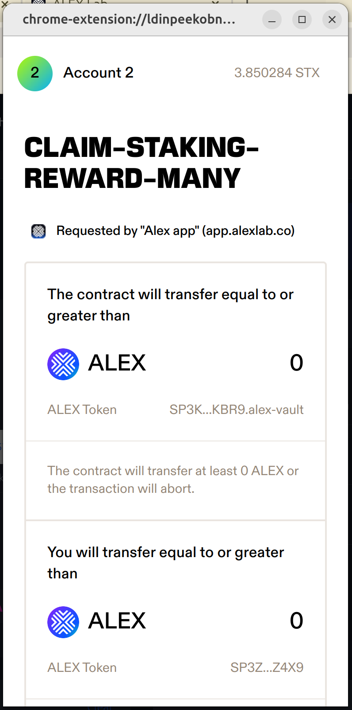<figcaption>
Transaction preview displayed on Leather wallet
</figcaption></figure>

<figure><figcaption>
Function arguments and confirmation button
</figcaption></figure>

#### Step 5: Check Transaction Status

Wait for the transaction to be confirmed on the network. 

Transferring your rewards and staked tokens could take between 20-40 minutes, but once the transaction is confirmed on the ALEX network, you will be able to see your rewards in your wallet.


Recommended to track transaction status:

* Turn on [Telegram notifications](https://t.me/stacks\_tx\_notification\_bot), you will get notified when the transaction is confirmed.
* Search for the transaction on the [ALEX Explorer](https://app.alexlab.co/explorer).
* Check your address activity on the wallet.


<figure>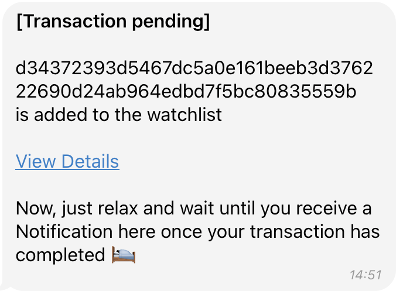<figcaption>
Telegram message with transaction pending status.
</figcaption></figure>

<figure>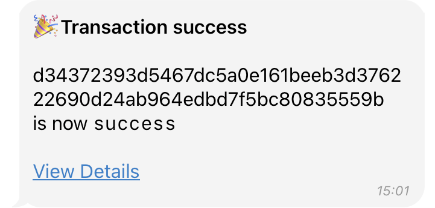<figcaption>
Telegram message with transaction success status.
</figcaption></figure>

## Auto Stake (Liquid Staking)

#### Step 1: Check My Staking

Head to the [Stake page](https://app.alexlab.co/stake), or, alternatively, click on the navbar's `Earn` -> `Stake` tab from the [ALEX Labs homepage](https://app.alexlab.co).

Once you're on the Stake page, you'll find the **My Staking** panel, which displays your current stake. 

#### Step 2: Auto Stake Your Principal & Your Rewards

If a cycle has ended and you can claim rewards, you will see the amount of claimable $ALEX and APower on the `Harvest` button. If you have no rewards to claim yet, the `Harvest` button will be greyed out. 

Below the button, you will see the `Auto Stake` slider. Click on it if you wish to proceed to Liquid Staking and receive LiALEX in exchange for staking your rewards.

Bear in mind that, if your staking period has ended, `Auto Stake` will also stake your **Principal** (your original $ALEX stake) rather than just your rewards. It is not possible to auto stake only a portion of your principal or your rewards.

With the `Auto Stake` slider in green, click on the `Harvest` button to stake your rewards.

<figure>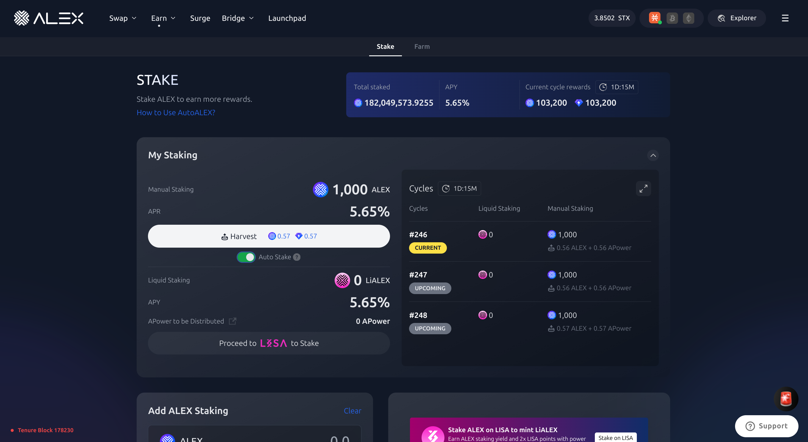<figcaption>
.
</figcaption></figure>

#### Step 3: Confirm Auto Stake

A confirmation panel will appear where you can double check the amount. If everything looks correct, click `Confirm`.

<figure>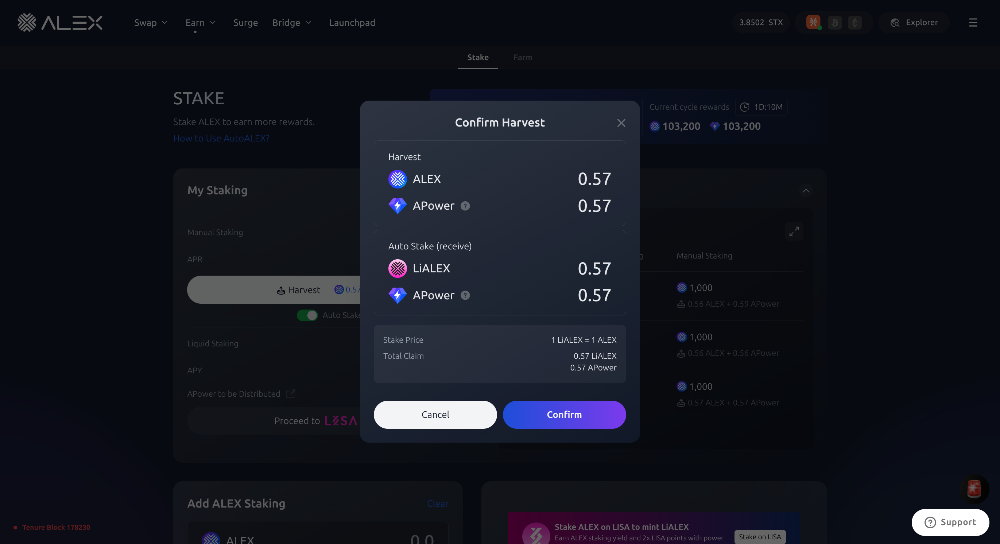<figcaption>

</figcaption></figure>

##### Confirm Harvest

* **Harvest:** The amount of staked $ALEX that will be auto staked and the amount of APower that you have earned by staking. &#x20;
* **Auto Stake (receive):** The amount of LiALEX tokens you will receive in exchange for continuing to stake your $ALEX. This allows you the benefit of maintaining liquidity while continuing to earn staking rewards.
* **Stake Price:** The price of LiALEX relative to ALEX.
* **Total Claim:** The amount of LiALEX and APower that will be transferred to your wallet. Your ALEX tokens will continue being staked.

#### Step 4: Confirm Transaction

After clicking `Confirm`, you will need to confirm the transaction in your wallet.

Here, your Stacks wallet is interacting with ALEX smart contract and is asking you for approval. Scroll through the wallet transaction window, review it and confirm the transaction. By doing this, you are allowing the wallet to sign and broadcast the transaction.

<figure>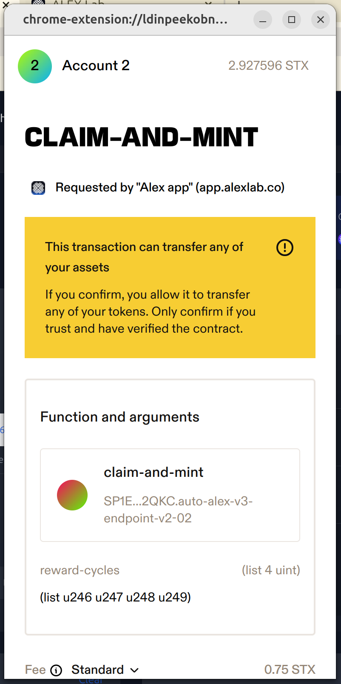<figcaption>
Transaction preview displayed on Leather wallet
</figcaption></figure>

<figure>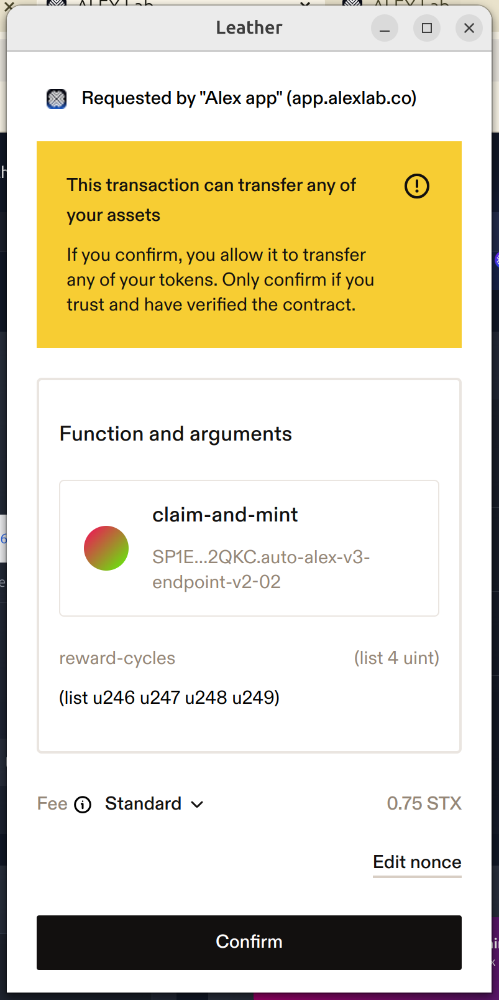<figcaption>
Function arguments and confirmation button
</figcaption></figure>

#### Step 5: Confirm Transaction on Your Wallet

Wait for the transaction to be confirmed on the network.

Your LiALEX could take between 20-40 minutes to appear on the [Stake page](https://app.alexlab.co/stake), but once the transaction is confirmed on the ALEX network, you will be able to see your staked tokens in the **My Staking** section.

<figure><figcaption>"My Staking" panel</figcaption></figure>


Recommended to track transaction status:

* Turn on [Telegram notifications](https://t.me/stacks\_tx\_notification\_bot), you will get notified when the transaction is confirmed.
* Search for the transaction on the [ALEX Explorer](https://app.alexlab.co/explorer).
* Check your address activity on the wallet.


<figure><figcaption>
Telegram message with transaction pending status.
</figcaption></figure>

<figure><figcaption>
Telegram message with transaction success status.
</figcaption></figure>

