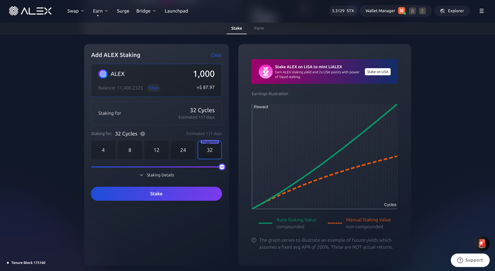

# How to stake on ALEX

Staking on ALEX takes a few easy steps. In short, it consists of locking up your tokens temporarily to help secure the ALEX network and gain rewards in return. In staking, time is measured in cycles, and at the end of each cycle, you will be able to harvest your rewards.

### Step 1: Connect Stacks Wallet

If you haven't already, the first step is to connect your wallet to ALEX. Go to the [Stake page](https://app.alexlab.co/stake) and under the "My Staking" section, press the "Connect stacks wallet" button. After performing the corresponding validation, "My Staking" will display. 

You can always change your wallet configuration from the Wallet Manager in the top right corner.

<figure><figcaption></figcaption></figure>

### Step 2: My Staking

In "My Staking", "Manual Staking" will indicate how much ALEX you're currently staking, along with its estimated Annual Percentage Rate (APR). Bear in mind that, unlike Annual Percentage Yield (APY), APR doesn't take into account the compounding effect of rewards.

On the right-hand side of "My Staking", you will see the "Cycles" section, which indicates how much time is left for the upcoming cycle, as well as the number of the current one. You can expand this section to display "All Cycles." The timer indicates how much time is left of the current cycle. Bear in mind that your tokens will be staked on the upcoming cycle for the first time.

<figure><figcaption></figcaption></figure>

Once you've verified that the current APR and waiting time until the next cycle align with your expectations, you can proceed to the next step.

### Step 3: Add ALEX Staking

Select how much $ALEX you wish to stake and for how long. You can use the slider to personalize the amount of cycles, and you will see an estimate of how many days the selected amount of cycles will last. If you wish to stake ALEX tokens for different periods of time, you will need to execute two transactions. For example, if you wish to stake 100 ALEX for 8 cycles and 80 ALEX for 24 cycles, you will need to follow these steps twice. 

<figure><figcaption></figcaption></figure>

In "Staking Details" you can see the numbers of the cycles you'll be staking for under your current settings, along with the corresponding "Start" and "End" blocks on the Stacks network. Afterwards, click "Stake" to begin staking.

### Step 4: Confirm Staking

You will be prompted to confirm that the selected settings are correct. Please verify the information on the pop-up window and press "Confirm" to continue.

<figure><figcaption></figcaption></figure>

Your Stacks wallet will validate your identity and ask you to confirm the transaction. 

### Step 5: Check Transaction Status

A "Transaction Mining..." pop-up should appear on the top right corner of your screen, followed by "Transaction Successful" a few moments later. 

Recommended to track transaction status:

* Turn on [Telegram notifications](https://t.me/stacks\_tx\_notification\_bot), you will get notified when the transaction is confirmed.
* Search for the transaction on the [ALEX Explorer](https://app.alexlab.co/explorer).
* Check your address activity on the wallet.

Your staked tokens could take up to 40 minutes to appear on the [Stake page](https://app.alexlab.co/stake), but once the transaction is confirmed on the ALEX network, you will be able to see your staked tokens in the "My Staking" section.

<figure><figcaption></figcaption></figure>

