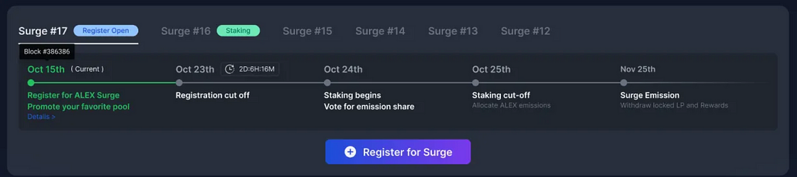
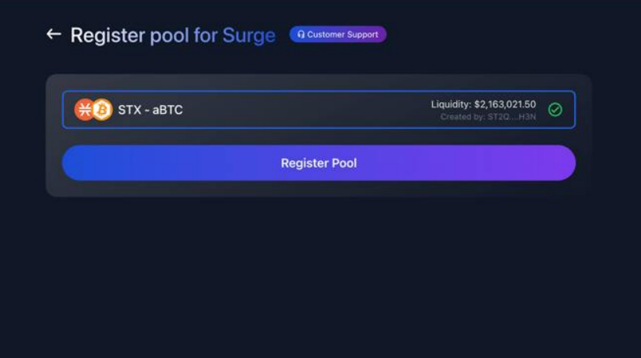
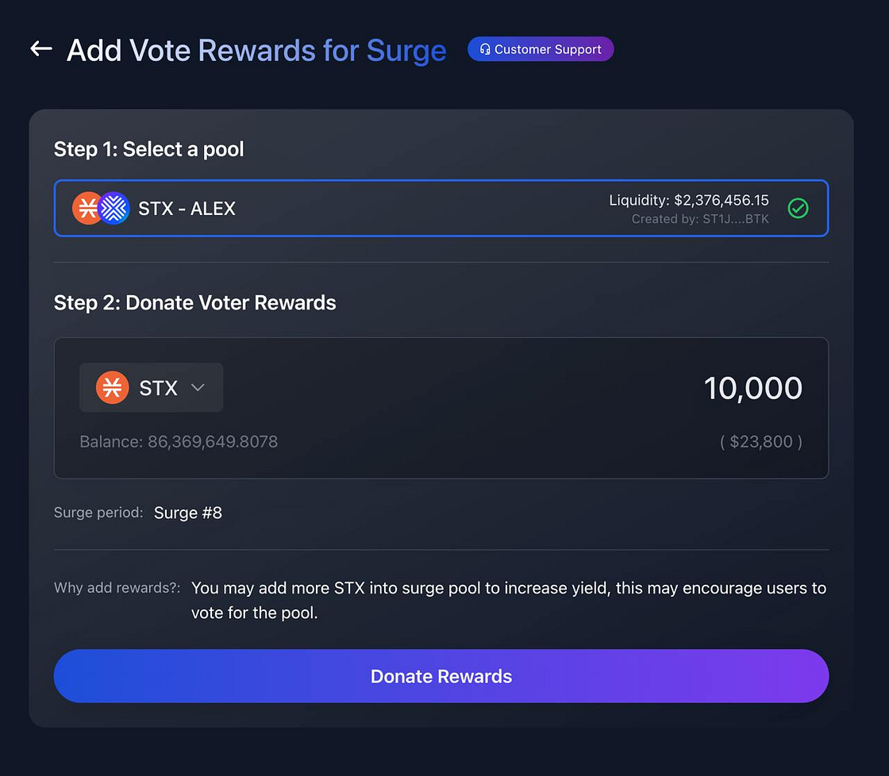
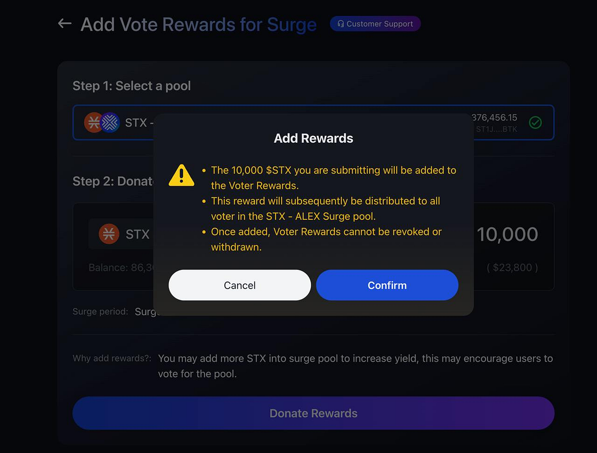
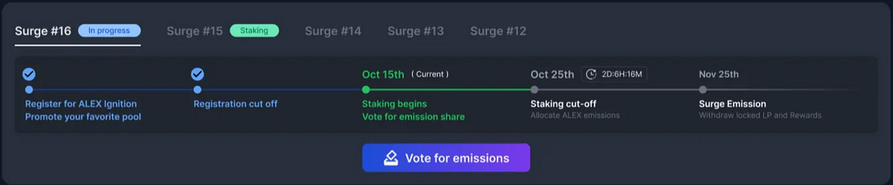
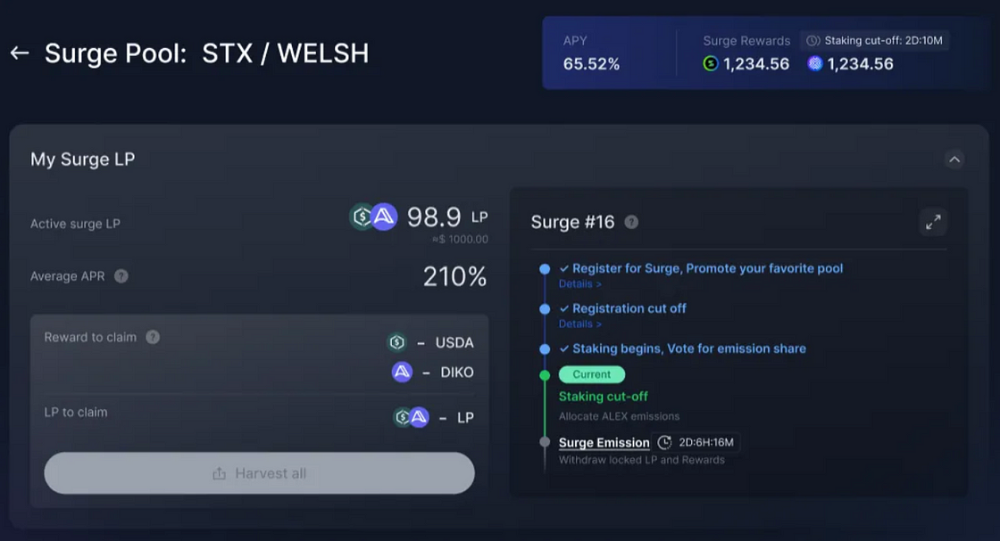

# 💡 How to Participate in ALEX Surge

ALEX Surge is a **round-based liquidity incentives program** that rewards participants, including **liquidity providers (LPs) and voters**, for contributing to deeper and more robust liquidity pools on ALEX.  

This guide will walk you through the steps required to **register a pool, vote, stake LP tokens, and claim rewards**.

## ⚡ Step 1: Register a Pool  

If you are a project owner or community member, you can register a liquidity pool to participate in the Surge campaign.

### 📌 How to Register:
1. Go to the [ALEX Surge App](https://app.alexlab.co/surge) and click `Register for Surge`.
<figure><figcaption>Surge registration</figcaption></figure>
2. Complete the registration process before the **cut-off date**.

<figure><figcaption>Surge registration</figcaption></figure>

3. Optionally, **donate voter rewards** to encourage more votes for your pool. **Once donated, voter rewards cannot be revoked or withdrawn**.

<figure><figcaption>Donating voter rewards</figcaption></figure>

<figure><figcaption>Confirming voter rewards donation</figcaption></figure>

4. Promote your pool on **social media** by posting and engaging with tweets about your project.  
   - Use **@alexlabbtc** and **#ALEXSurge** in your tweets.  
   - Submit tweets via **Discord** or **Blocksurvey** to improve your ranking on the Social Leaderboard.

Once registered, your pool will appear on the **Social Leaderboard**, where it will be ranked based on **Twitter/X engagement metrics**.

---

## 🗳️ Step 2: Vote and Stake  

During the voting and staking phase, users can **vote for pools and stake their LP tokens**.

### 📌 How to Vote:
1. After the registration cut-off, go to the [Surge App](https://app.alexlab.co/surge) and click `Vote for Emissions`.
2. Choose how to **split your voting power** (determined by your **ALEX and LiALEX holdings**) among different pools.
3. **Submit your vote**. **You can only vote once per round per wallet**.

<figure><figcaption>Voting interface</figcaption></figure>

<figure><figcaption>Allocating voting power</figcaption></figure>

Pools that receive more votes will get a **higher share of the $ALEX rewards**.

### 📌 How to Stake LP Tokens:
1. Before the staking phase ends, go to the **Surge Staking section**.
2. Click `+ Stake LP` on the pool you want to stake in.
3. You can stake LP tokens in **multiple pools**.
4. Rewards will be distributed **proportionally** based on the amount staked.

<figure><figcaption>Staking LP tokens in Surge pools</figcaption></figure>

🚨 **Important Notes:**  
- The **ALEX Lab Foundation** also votes but **does not receive voter rewards**.  
- The voting **percentage** at the end of the staking phase determines how the **$ALEX rewards** are distributed.  

---

## 💰 Step 3: Claim Your Rewards  

Once the voting and staking phase ends, the **reward emission phase** begins.

### 📌 How to Claim Rewards:
1. **Wait for the rewards emission phase to complete** (usually **27–28 days**).

<figure><figcaption>Overview of pending rewards before claiming</figcaption></figure>

2. Go to the **Surge App** and navigate to the `Claim Rewards` section.
3. Click `Harvest All` to **claim your LP tokens and earned $ALEX rewards**.

<figure><figcaption>Claiming rewards and LP tokens</figcaption></figure>

Once a Surge round ends, a new round begins, following the same process.

---

## 🔥 Social Leaderboard and Additional Incentives  

ALEX Surge includes a **Social Leaderboard Campaign**, where pools can improve their ranking by engaging with the community on **Twitter/X**.

### 📌 How to Improve Your Pool's Ranking:
- **Post about your project** using **@alexlabbtc** and **#ALEXSurge**.
- **Submit tweets via Discord or Blocksurvey** to be counted towards the leaderboard.
- **Engagement matters**:  
  - **Likes** → **0.5X multiplier**  
  - **Reposts/Quote Reposts** → **1.25X multiplier**  
  - **Replies** → **1.5X multiplier**  

Pools with higher engagement **receive more votes from the ALEX Lab Foundation**, increasing their rewards.

---

## Need Help?  

For assistance, please reach out to our Community Managers on [Discord](https://discord.com/invite/alexlab) and [Telegram Channel](https://t.me/AlexCommunity).  

---

🚀 **Now you’re ready to participate in ALEX Surge and start earning rewards!**
