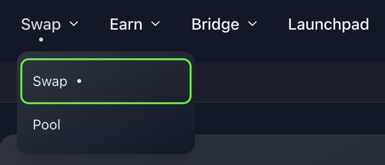
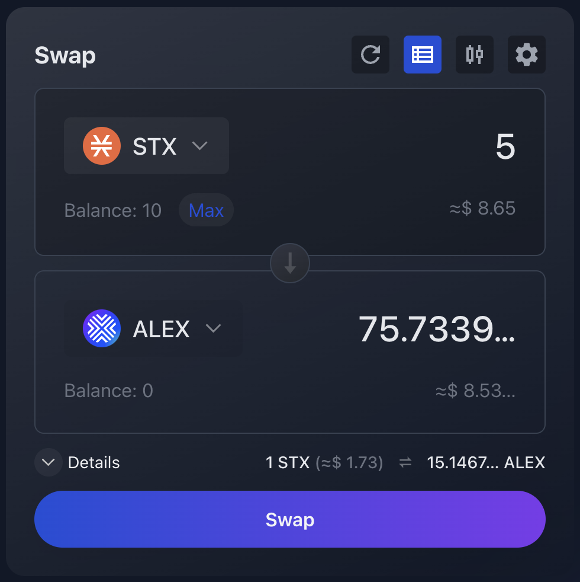
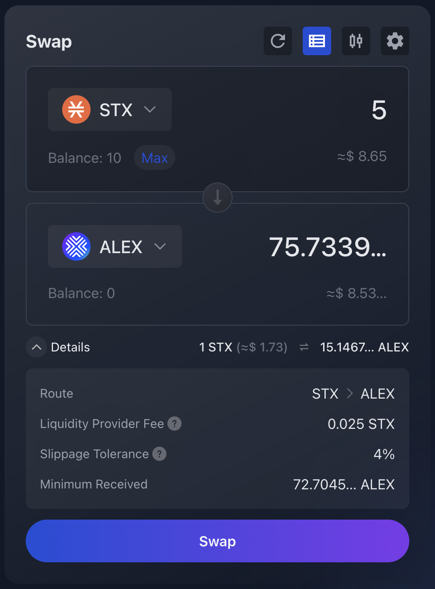
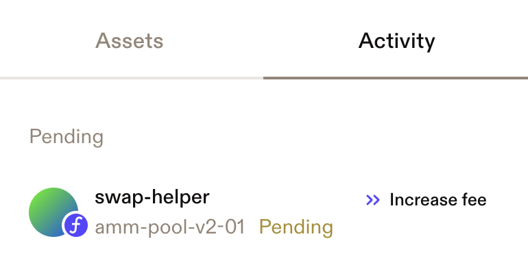

# How to Swap

When performing a token swap, you transfer an amount of the token you want to exchange (base token) to the ALEX smart contract. In return, you receive a pre-agreed amount of the desired token (target token) from the ALEX smart contract, all within a single swap transaction. The resulting balance changes will be reflected in your wallet.

That said, let's get hands-on!

## :currency\_exchange: :moneybag: Trade one token for another

### Step 1: Go to the Swap Panel

Go to [https://app.alexlab.co/](https://app.alexlab.co/) to see the Swap panel. You can also navigate to it by clicking the "Swap" tab on the top menu bar.

<figure><figcaption></figcaption></figure>

 

<figure><figcaption></figcaption></figure>

### Step 2: Select Token Pair

Select the tokens you want to exchange and the amount.&#x20;

* The token at the top is the **base** token, the token you currently hold and want to exchange.
* The token below is the **quoted** or **target** token, the token you will receive in the trade.
* The dropdown arrow next to the token symbol will open the **token search** and **selection panel**.
* Below the amounts, you will find the current **exchange rate**, as well as the USD equivalent.
* The central down-pointing arrow shows the **direction of the transaction**. In the below example, STX will be exchanged for ALEX. By clicking the arrow, you can quickly **invert** the order of the transaction: the base token becomes the quoted token and vice versa.

<figure><figcaption>
Example of the Swap panel displaying exchange of 5 STX into ALEX governance tokens.
</figcaption></figure>


Clicking the "Max" button will automatically set the amount to your total available balance.


<figure><figcaption>
Token search and selection panel. 
</figcaption></figure>

### Step 3: Review Transaction Details & Adjust Settings (Optional)

#### Transaction Details

Check the transaction details by clicking the dropdown "Details" arrow below the amounts. This will expand a Details panel with relevant trading information.

* **Route:** The exchange route to convert from the base token into the target token. In the example we see STX -> ALEX, indicating it is a one-step or direct swap.&#x20;
* **Liquidity Provider Fee:** The swap fee, which is shared between the Liquidity Providers (LPs) and the ALEX Lab Platform.&#x20;
* **Price Impact:** How much your swap affects the exchange rate.
* **Slippage Tolerance:** The maximum percentage of price movement you'll accept between the time you submit the transaction and its execution. The default slippage tolerance setting is 4%, but you can select a custom percentage. If price movement exceeds the slippage tolerance, the transaction will be reverted.
* **Minimum Received:** The minimum amount of target token you will receive considering the maximum slippage variation.

<figure><figcaption>
Swap panel with Transaction Details panel expanded.
</figcaption></figure>

#### Transaction Settings

If you want to adjust slippage tolerance, select the "Settings" icon to open the Transaction Settings panel. Set your desired tolerance and click "Confirm". This will determine your allowed range for price movement. Your transaction will revert if the price changes unfavourably by more than this percentage.&#x20;

<figure><figcaption>
Transaction Settings icon.
</figcaption></figure>

<figure><figcaption>
Transaction Settings panel example, with slippage tolerance set to 2%.
</figcaption></figure>

### Step 4: Confirm Swap

Once you're ready to move ahead, select the "Swap" button which will bring up the Confirmation panel. This panel provides a final overview of your transaction details, allowing you to double-check price, route, fees and slippage. If everything looks good, click "Confirm" 😎.

<figure><figcaption></figcaption></figure>

### Step 5: Confirm Transaction

After clicking "Confirm", you will need to confirm the transaction in your wallet. Here, your Stacks wallet is interacting with ALEX smart contract and is asking you for approval. Scroll through the wallet transaction window, review it and confirm the transaction. By doing this, you are allowing the wallet to sign and broadcast the transaction.


To be completely sure, you can check:

* The transaction is requested by **"Alex app" (app.alexlab.co)**
* The transfer amounts, covered by [Stacks post conditions](https://docs.stacks.co/stacks-101/post-conditions). If these conditions are not met, the transaction will abort. Note:
  * The amount you transfer to the smart contract is exactly determined (STX in the example).
  * The amount the smart contract transfers to you (ALEX in the example) is subject to an "equal to or greater than" condition. This accounts the potential slippage variation, and here you can see the exact lower bound.


<figure><figcaption>
Transfer amounts involved and post conditions.
</figcaption></figure>

 

<figure><figcaption>
Function arguments and confirmation button.
</figcaption></figure>

### Step 6: Wait for Confirmation 

Wait for the transaction to be confirmed on the network.


Recommended to track transaction status:

* Turn on [Telegram notifications](https://t.me/stacks_tx_notification_bot), you will get notified when the transaction is confirmed.
* Search for the transaction on the [ALEX Explorer](https://app.alexlab.co/explorer).
* Check your address activity on the wallet.


<!-- Real tx: https://explorer.hiro.so/txid/0x4018603651b9fbed296a575b7eb7e08e12764e97faf7448a7862eccad26dfb35?chain=mainnet -->

<figure><figcaption>
Telegram message with transaction pending status.
</figcaption></figure>

 

<figure><figcaption>
Telegram message with transaction success status.
</figcaption></figure>

<figure><figcaption>
Transaction pending displayed on Leather wallet.
</figcaption></figure>

 

<figure><figcaption>
Transaction completed, token transfers are visible.
</figcaption></figure>

### Step 7: View Updated Balance

Once the transaction is completed, you will see the balance updated in your wallet.&#x20;

Thank you for successfully swapping on ALEX! :arrows\_counterclockwise: :moneybag: :white\_check\_mark:&#x20;
