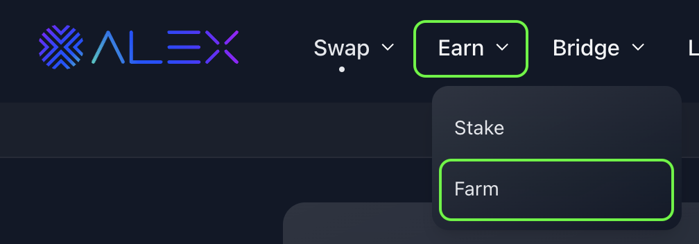
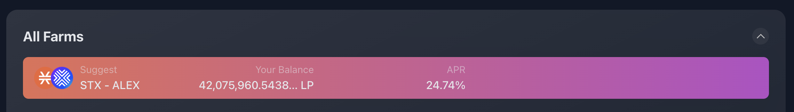
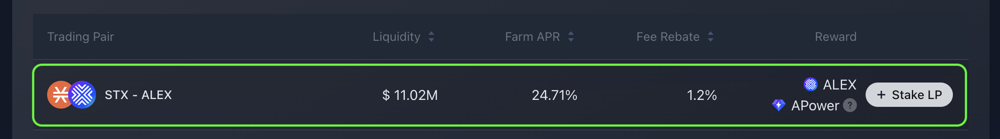
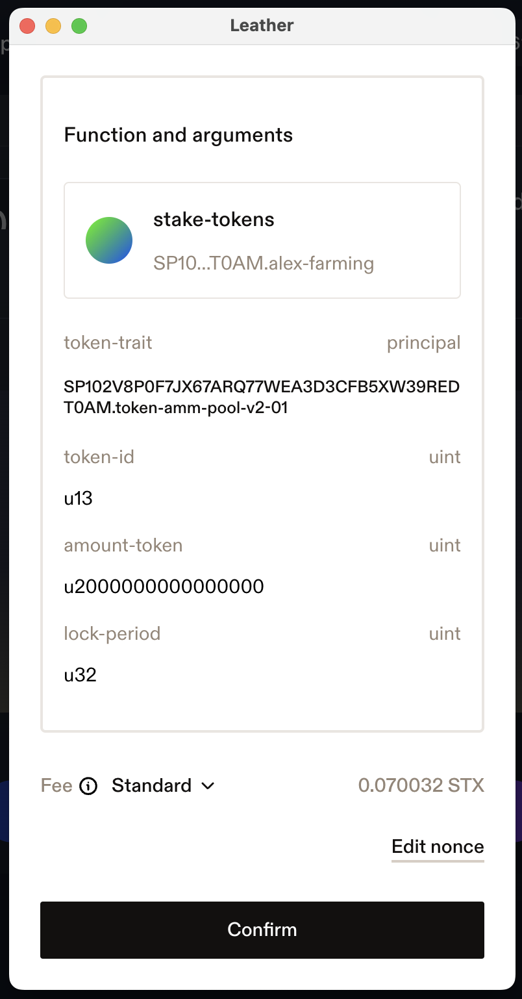
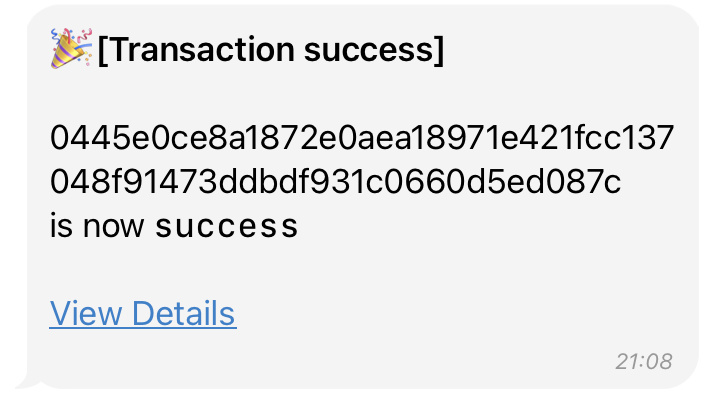
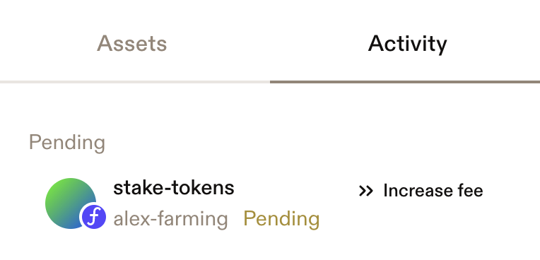
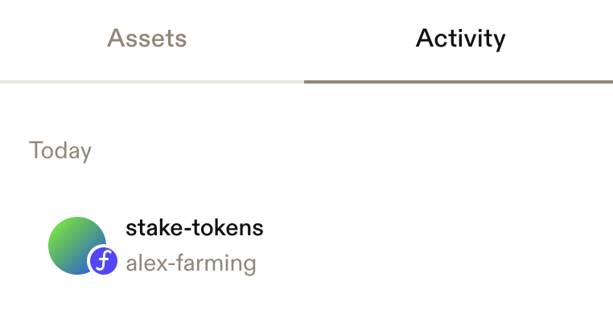
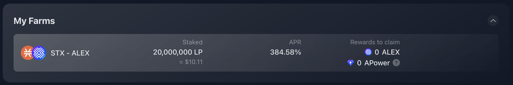
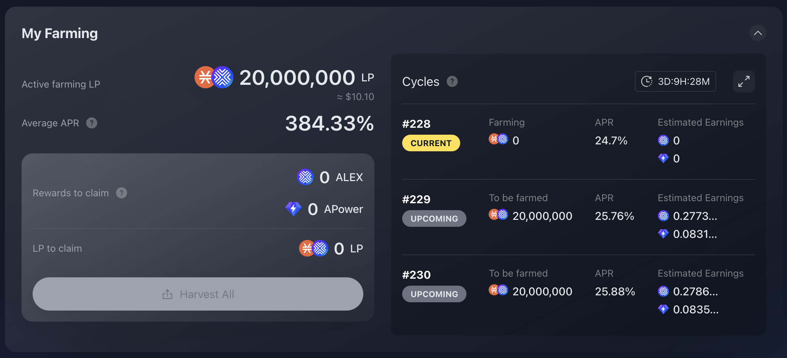

# How to farm & harvest

Yield farming takes a few easy steps to get set up. It works very similar to standard staking, with the key difference being that the tokens you stake are LP tokens. As in traditional staking, you lock up your tokens for a certain period (measured in cycles) and earn rewards over time. After each (except for the first cooldown one), you will have rewards available to harvest.

It is very important to understand that farms only accept their specific native LP tokens. For example, the STX-ALEX farm will only accept STX-ALEX LP tokens, which are the tokens you receive in exchange for providing liquidity to the STX-ALEX pool. There are different LP tokens corresponding to each liquidity pool on the ALEX Lab Platform.

With this information in mind, choose the guide that best fits your needs.

## Guides

* [🐥 Getting started (from scratch)](how-to.md#getting-started)
* [🌻 How to put LP tokens in a farm (stake)](how-to.md#how-to-put-lp-tokens-in-a-farm-stake)
* [🚜 Harvesting your farming rewards](how-to.md#tractor-harvesting-your-farming-rewards)
* [🛎️ Withdrawing LP tokens (unstake)](how-to.md#withdrawing-lp-tokens-unstake)

## :hatched\_chick: Getting started

### Finding your farm

Before proceeding, choose a farm that aligns with your goals. Go to [https://app.alexlab.co/](https://app.alexlab.co/) and navigate to the Earn -> Farm tab.

<figure><figcaption></figcaption></figure>

You'll see a list of all the available farms along with key information. You can sort the farms by various metrics and scroll to explore different reward tokens offered.&#x20;

<figure><figcaption></figcaption></figure>

#### Farm Basics

* **Trading Pair:** The specific LP token the farm accepts.&#x20;
* **Reward:** The earnings you obtain when harvesting the farm.

#### Farm Metrics

* **Liquidity:** The total USD value of the staked tokens in the farm.
* **Farm APR:** Potential annual earnings from farming, based on the most recent cycle yields. This metric represents the potential profitability of participating in a farm over a year, assuming the total staked tokens remain similar to the last cycle.
* **Fee Rebate:** Potential annual earnings from providing liquidity. Also known as Pool APR, it reflects the potential profitability of participating in a liquidity pool over a year, assuming similar trading activity continues. This value matches the one displayed on the ALEX Lab [Pool list](https://app.alexlab.co/pool).&#x20;

Once you find a farm that fits your goals, note the **Trading Pair** (e.g., STX-aBTC)  as you will need it in the next step.

### Providing liquidity to get LP tokens

Now that you've chosen a farm to stake in, you'll need LP tokens, which are obtained by adding liquidity to a pool.

1. Click on the Pool tab in the top navigation bar.

<figure><figcaption></figcaption></figure>

2. Find the pool that matches the **Trading Pair** you noted before. This is the liquidity pool linked to the farm you've selected.&#x20;
3. Click on the pool. This will open the pool control panel, where you can add liquidity.&#x20;

We have a [Guide to Adding Liquidity](../liquidity-providers/how-to.md#adding-liquidity) that you can follow to obtain LP tokens.

## :sunflower: How to put LP tokens in a farm (stake)

If you have LP tokens, you're ready to start staking them in a farm and earning rewards!

### Step 1

Go to the [Farms page](https://app.alexlab.co/farm) and locate your farm of interest. You can access it by navigating to [https://app.alexlab.co/](https://app.alexlab.co/) and selecting the Earn -> Farm tab.&#x20;

At the top of the farm list, you'll see the farms suggested by the ALEX Lab Platform based on your LP tokens balance. In the example below, the suggested farm is STX-ALEX. This indicated that the user has provided liquidity in the STX-ALEX pool and has LP tokens available for farming.

<figure><figcaption>
Example of farm suggestions. This user is a STX-ALEX pool provider and possesses STX-ALEX LP tokens that can be staked in the STX-ALEX farm.
</figcaption></figure>

### Step 2

Select the farm you want to stake in from the farm list.

<figure><figcaption></figcaption></figure>


When hovering over a farm, you may notice a "+ Stake LP" button. This serves as a visual indicator for the selected farm. Clicking it will take you to the same screen as clicking anywhere on the farm's row.


### Step 3

Once you have selected the farm, enter the amount of LP tokens you would like to stake, or click "Max" to use all available LP Tokens.&#x20;

Next, choose the number of reward cycles you want to lock your tokens into the farm. Each cycle is approximately 3.5 days. 

<figure><figcaption>
Example with an amount of LP tokens to stake for 32 cycles.
</figcaption></figure>


Your staked amount will start generating yield from the next upcoming cycle, as the current cycle is in "cooldown" period. To maximize the APR you earn, it's best to stake for longer cycle periods to avoid missing out on any reward cycles due to this cooldown cycle. That's why 32-cycle staking is recommended.


### Step 4

Once you have entered the amount, click the "Stake" button. Confirmation panel will appear. Here you can double check amount and reward cycles. If everything looks okay, click "Confirm" 😎

<figure><figcaption></figcaption></figure>

### Step 5

After clicking "Confirm", you will need to confirm the transaction in your wallet. Remember that farming locks up LP tokens in a smart contract for the selected number of reward cycles.

At this point, your Stacks wallet is interacting with ALEX smart contract and is asking you for approval. Scroll through the wallet transaction window, review it and confirm the transaction. By doing this, you are allowing the wallet to sign and broadcast the transaction.


To be completely sure, you can check:

* Transaction is requested by **"Alex app" (app.alexlab.co)**
* The amounts you will transfer to the smart contract, covered by [Stacks post conditions](https://docs.stacks.co/stacks-101/post-conditions).&#x20;


<figure><figcaption>
Wallet pop-up with function arguments and confirmation button.
</figcaption></figure>

### Step 6

Wait for the transaction to be confirmed on the network.

<figure><figcaption></figcaption></figure>


Recommended to track transaction status:

* Turn on [Telegram notifications](https://t.me/stacks\_tx\_notification\_bot), you will get notified when the transaction is confirmed.
* Search for the transaction on the [ALEX Explorer](https://app.alexlab.co/explorer).
* Check your address activity on the wallet.


<!-- Real tx: https://explorer.hiro.so/txid/0x0445e0ce8a1872e0aea18971e421fcc137048f91473ddbdf931c0660d5ed087c?chain=mainnet -->

<figure><figcaption>
Telegram message with transaction pending status.
</figcaption></figure>

 

<figure><figcaption>
Telegram message with transaction success status.
</figcaption></figure>

<figure><figcaption>
Transaction pending displayed on Leather wallet.
</figcaption></figure>

 

<figure><figcaption>
Transaction completed.
</figcaption></figure>

### Step 7

After successfully staking your LP tokens in a farm, you will be able to see your active farms in the "My Farms" panel on the main [Farms page](https://app.alexlab.co/farm).

<figure><figcaption>
Example of the "My Farms" panel. Here you will find all your active farms; click on any of them for detailed information.
</figcaption></figure>

By clicking on a farm, you will access the "My Farming" dashboard for that specific farm, which includes detailed metrics. On the right side of the dashborad, you will see that the current cycle has no earnings and no farming tokens. This is due to the cooldown period, farming will start in the next upcoming cycle. This is why it's convenient to stake for long periods: every time you stake, you must wait for the current cycle to end before you start generating rewards in the next cycle.

For more info on the "My Farming" dashboard and metrics, we recommend reading the [Key concepts](key-concepts.md) page.

<figure><figcaption>
Example of the "My Farming" dashboard for the STX-ALEX farm. The user has just staked, so it is in the cooldown period.
</figcaption></figure>

Now that you have your tokens staked on a farm, you rewards are growing 🌱. Be patient 🧘 and when the time comes, check out the following guide on how to harvest your rewards.

## :tractor: Harvesting your farming rewards

Farming will earn you rewards over time.

At the end of every staking cycle (525 blocks, approximately 3.5 days), rewards will be available to harvest. To claim your rewards, follow these steps:

1. Go to the [Farms page](https://app.alexlab.co/farm) on ALEX Lab App, which you can access through the Earn -> Farm tab.&#x20;
2. You will find the **My Farms** panel which your active farms. Click on the farm you want to harvest, either from the panel or from the farm list.
3. Expand the **My Farming** dashboard. If a cycle has ended, you will see rewards available to claim.
4. Click on the "Harvest All" button and confirm the transaction on your wallet (just as you did in the previous guides).
5. Wait for the transaction to be confirmed on the network. Remember, you can turn on [Telegram notifications](https://t.me/stacks\_tx\_notification\_bot) or search for the transaction on the [ALEX Explorer](https://app.alexlab.co/explorer).
6. Once the transaction is completed, the reward amounts will be reflected in your wallet balance. You can always check your balance also on the ALEX Lab App, located beside the "Wallet Manager" at the top menu bar.

You can collect these rewards and use them for various purposes on the ALEX Lab Platform. For example, you can [stake](https://app.alexlab.co/stake) your $ALEX rewards manually to generate compounding interest. You can also use your APower rewards to increase your access to IDOs on the [ALEX Launchpad](https://app.alexlab.co/launchpad). You can even buy more LP tokens!

### How often should I harvest my rewards?

To maximize your returns, it is best to harvest your rewards at the end of every cycle. This way, you have them available to generate more rewards! 🤩

For example, you can manually stake your \$ALEX rewards to generate compounding interest. If your rewards are another token, you can still [swap](https://app.alexlab.co/swap) and convert them to \$ALEX. Another option would be to use your rewards to buy more LP tokens and benefit from being a [liquidity provider](../liquidity-providers/README.md).

Happy Farming! 🥕 🥬 🍅

## :bellhop: Withdrawing LP tokens (unstake)

Withdrawing you LP tokens takes just a few steps. The important thing is when to do it.

When farming, you are commit to locking up your tokens for a predefined period (reward cycles, each one ~3.5 days). Once these cycles conclude, you will be able to unstake them and regain control over your LP tokens.

If you staked multiple times at different moments, the lock periods apply to each amount separately.

Let's go through it step-by-step:

1. Go to the [Farms page](https://app.alexlab.co/farm) on ALEX Lab App, which you can access through the Earn -> Farm tab.
2. Find the farm from which you want to withdraw LP tokens and click on it.
3. You will see the **My Farming** dashboard. Expand it to see all your farming details.
4. Your LP tokens will automatically be available for withdrawal when your committed cycles end. You will find them under the **LP to claim** title on the dashboard.
5. Click on the "Harvest All" button and confirm the transaction in your wallet (just as you did in the previous guides). This will return your LP tokens back to your possession and automatically collect any unharvested rewards.
6. Wait for the transaction to be confirmed on the network. Remember, you can turn on [Telegram notifications](https://t.me/stacks\_tx\_notification\_bot) or search for the transaction on the [ALEX Explorer](https://app.alexlab.co/explorer).
7. Once the transaction is completed, you will see the changes reflected in your wallet balance and on the platform panels. In particular, you will see your LP token balance on the [Pool page](https://app.alexlab.co/pool) in the **My Liquidity** panel or by selecting the pool from the list. You can also check your balance on the ALEX Lab App, located beside the Wallet Manager at the top menu bar.

If you want to farm your LP tokens again, remember: your staked amount will start generating yield from the next upcoming cycle, as the current cycle is in cooldown period. To maximize the APR you earn, it's best to stake for longer cycle periods to avoid missing out on any reward cycles due to the cooldown period.

Thanks for farming on ALEX Lab! 🧑‍🌾