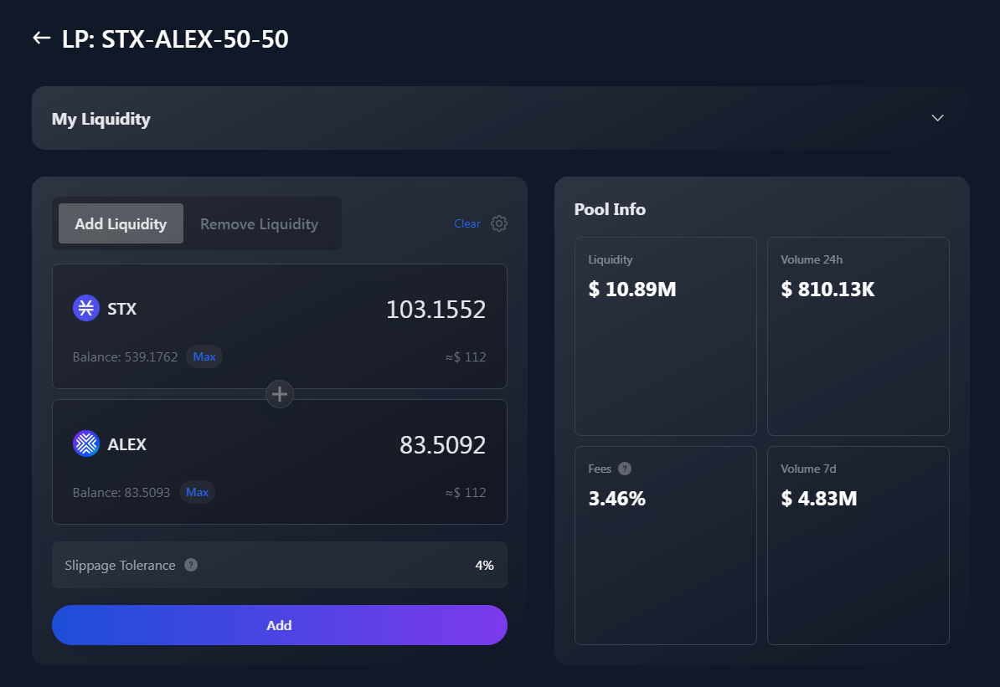

# 🐋 Liquidity Pool

## Liquidity Pool

You can become a liquidity provider by submitting two tokens to the liquidity pool to begin earning a share of the trading fees.

The trading fee rebate is 0.3% per transaction of which 50% goes to Liquidity Providers and 50% goes to the platform.

_Example:_

* _Let’s assume you want to become a Liquidity Provider for STX/ALEX pool, assuming each has a $1 value so you add liquidity of 10 ALEX and 10 STX receive 10 LP tokens._
* _The 10 LP tokens represent a value of $20 (ALEX $10 & 10 STX $10)._
* _For each trade within the pool, the pool gets 0.3% per transaction_

You can remove your liquidity at anytime. If you are interested in receiving significantly higher returns as a liquidity provider however, you can chose yield farming which means you stake or lock up your LP tokens for a fixed amount of time to earn yield rewards. You will then receive trading fees as well as ALEX platform incentive tokens. When yield farming however, you can not remove your LP tokens until the staking period you selected ends.

