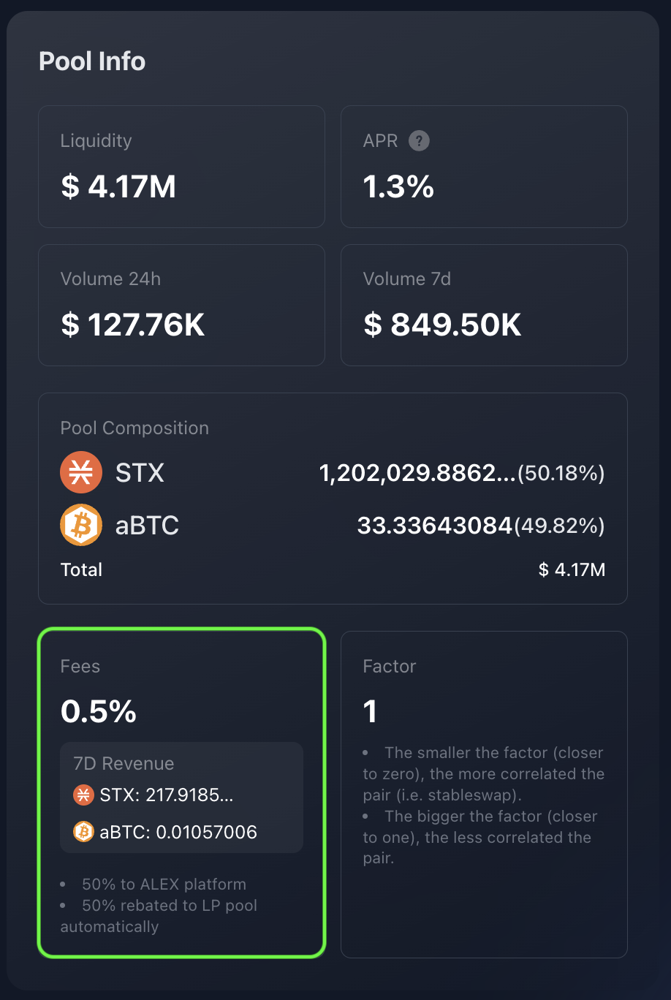

# FAQs

What is the difference between swap fee and fee rebate?

The **swap fee** is the total fee charged to users for executing a token swap. It's the fee that directly impacts the trader and is displayed as "Fees" in the Pool Info panel.

On the other hand, the **fee rebate** is the portion of the swap fee that is distributed to liquidity providers as a reward for supplying liquidity to the pool. The remaining portion of the swap fee goes to the ALEX platform. You can also find the fee rebate percentage in the Pool Info panel.

How does the fee rebate benefit liquidity providers?

The fee rebate is automatically reinvested into the pool, increasing the overall value of the pool. Since liquidity providers (LPs) hold a share of the pool, their holdings grow in value over time. However, these rewards can only be claimed when LP tokens (representing their share of liquidity) are withdrawn from the pool.

What is the swap fee percentage that goes to liquidity providers?

The swap fee percentage that goes to liquidity providers is known as the **fee rebate**. It is typically set at 50%, though it can vary depending on the pool. You can check this percentage in the Pool Info panel.

How is liquidity provision related to farming?

Liquidity providers can stake or lock up their LP tokens for a fixed period to earn additional rewards. These rewards are separate from the earnings generated through liquidity provision, that come from swap operations fees (trading fees). This process is known as Yield Farming, or simply 'Farming'. For more details, explore the [ALEX Farming](../farm.md) feature.

Can I remove liquidity at any time?

Yes, you can remove liquidity at any time. However, if you've staked your LP tokens for farming, you won't be able to withdraw them until the staking period has ended.

