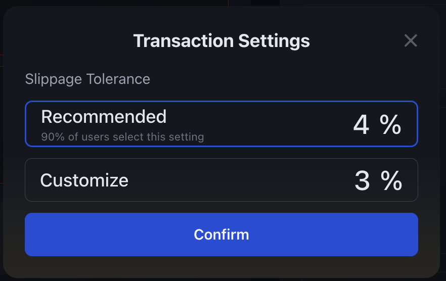
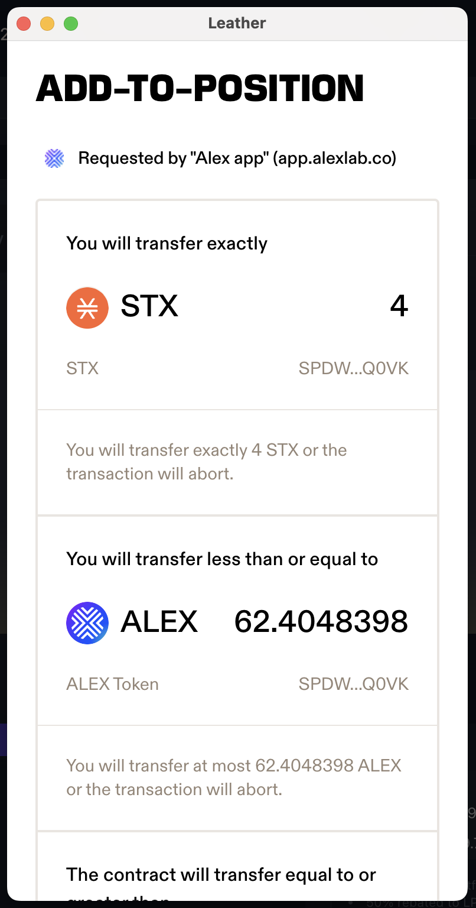
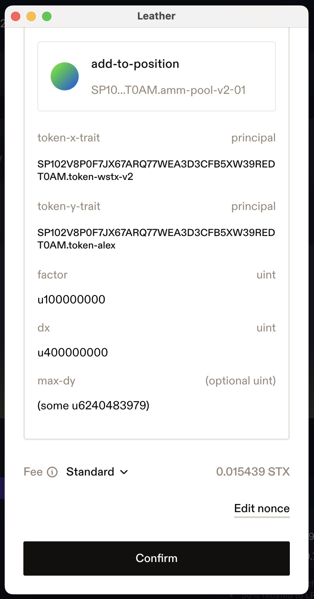
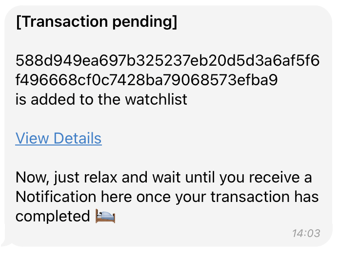
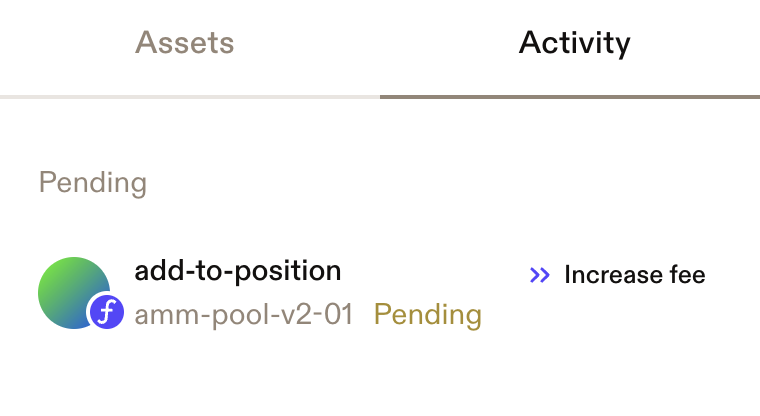
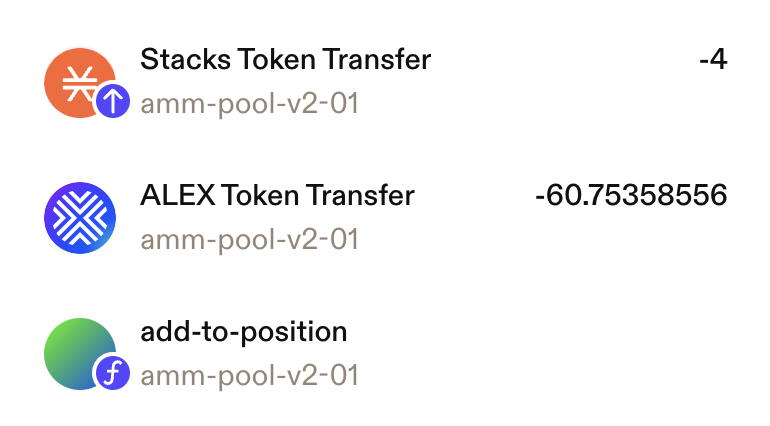

# How to add/remove liquidity

When **adding liquidity**, you will deposit an equivalent value of both tokens into the pool. In return, you'll receive LP tokens, which represent your share of that specific liquidity pool.

When **removing liquidity**, you will transfer your LP tokens back to the ALEX smart contract and withdraw an equivalent value of the token pair plus any fees accrued while holding those LP tokens.

## :palm\_up\_hand: :moneybag: Adding Liquidity

### Step 1

Go to [https://app.alexlab.co/](https://app.alexlab.co/) and click on navbar's Swap -> Pool tab.

<figure><figcaption></figcaption></figure>

### Step 2

All available pools will be displayed including information such as:

* **Trading Pair:** The token pair that constitute liquidity pools to which you can add liquidity.
* **Liquidity:** The total liquidity in the pool, expressed in USD value.
* **Volume:** The trading volume between the token pair over the last 7 days.
* **Fee Rebate:** Potential LP earnings from swap fees over a year, based on the last week's average. This metric, also known as Pool APR, reflects the potential profitability of participating in a pool over a year, assuming similar trading activity continues.&#x20;

Select the token pair to which you want to add liquidity from the displayed list. Note you can sort by pool metrics.

<figure><figcaption>
Selected STX - ALEX liquidity pool as example.
</figcaption></figure>


When hovering over a pool, you might notice a "+LP" button. This is just a visual indicator highlighting the selected pool. Clicking it will take you to the same screen as clicking anywhere on the pool's row.


### Step 3

After selecting a pool, you will be taken to a control panel for that specific liquidity pool, where you can add liquidity to the token pair and view more detailed metrics[^1].&#x20;

When you set the amount for one token, the corresponding amount for the other token is automatically calculated, as liquidity must be provided in equal value for both tokens.

<figure><figcaption>
Control panel example for STX - ALEX liquidity pool. Amount is set to 4 STX and ALEX token amount is automatically determined.
</figcaption></figure>


Clicking the "Max" button will automatically set the amount to your total available balance.


[^1]: The APR metric is the same as the displayed in the Fee Rebate column on the previous step.

### Step 4

If you want to adjust slippage, select the "Settings" icon to open the Transaction Settings panel and set your desired tolerance. The default slippage tolerance is set to 4%, meaning your transaction will revert if the exchange rate changes unfavourably by more than this percentage. The displayed number of LP tokens you will receive is approximate due to this potential variation.

<figure><figcaption>
Transaction Settings icon.
</figcaption></figure>

<figure><figcaption>
Transaction Settings panel example, with slippage tolerance set to 3%.
</figcaption></figure>

### Step 5

One you decide the amount, click the "Add" button. Confirmation panel will appear. Here you can double check balances, slippage and LP tokens. If everything it's okay, click "Confirm" :sunglasses:

<figure><figcaption></figcaption></figure>

### Step 6

After clicking "Confirm", you will need to confirm the transaction in your wallet. Here, your Stacks wallet is interacting with ALEX smart contract and is asking you for approval. Scroll through the wallet transaction window, review it and confirm the transaction. By doing this, you are allowing the wallet to sign and broadcast the transaction.


To be completely sure, you can check:

* Transaction is requested by **"Alex app" (app.alexlab.co)**
* The amounts you will transfer to the smart contract, covered by [Stacks post conditions](https://docs.stacks.co/stacks-101/post-conditions). Note that one transfer amount is exactly determined (STX in the example) while the other is subject to a "less than or equal to" condition. This accounts the potential slippage variation, and here you can see the exact upper bound. If these conditions are not met, the transaction will abort.


<figure><figcaption>
Amounts to transfer and post conditions.
</figcaption></figure>

 

<figure><figcaption>
Function arguments and confirmation button.
</figcaption></figure>

### Step 7

Wait for the transaction to be confirmed on the network.&#x20;

<figure><figcaption></figcaption></figure>


Recommended to track transaction status:

* Turn on [Telegram notifications](https://t.me/stacks_tx_notification_bot), you will get notified when the transaction is confirmed.&#x20;
* Search for the transaction on [explorer](https://explorer.hiro.so). &#x20;
* Check your address activity on the wallet.


<!-- Real tx: https://explorer.hiro.so/txid/0x588d949ea697b325237eb20d5d3a6af5f6f496668cf0c7428ba79068573efba9?chain=mainnet -->

<figure><figcaption>
Telegram message with transaction pending status.
</figcaption></figure>

 

<figure><figcaption>
Telegram message with transaction success status.
</figcaption></figure>

<figure><figcaption>
Transaction pending displayed on Leather wallet.
</figcaption></figure>

 

<figure><figcaption>
Transaction completed, token transfers are visible.
</figcaption></figure>

### Step 8

After successfully adding liquidity, you will be able to see your LP tokens and related details in "My Liquidity" panel.

* **My LP** are your LP token holdings specific to the pool you contributed to. Each pool issues its own unique LP tokens.
* The **Pooled** amount represents your total token holdings in the liquidity pool. Initially, reflects the amount you added and it increases over time due to accrued fees, showing your updated share of the pool's total liquidity.
* The **My Pool Share** shows how much of the overall pool you own, as a percentage.
* The **Indicative Value** reflects the value of your holdings in USD, which can change based on the price action of the underlying assets.

<figure><figcaption>
"My Liquidity" panel.
</figcaption></figure>


You can find the "My Liquidity" panel above the Liquidity Pool control panel (shown in Step 3). A summarized version is also available under the Swap -> Pool tab or at https://app.alexlab.co/pool.


## :palm\_down\_hand: :moneybag: Removing liquidity

### Step 1

As when adding liquidity, go to [https://app.alexlab.co/](https://app.alexlab.co/) and click on navbar's Swap -> Pool tab.

<figure><figcaption></figcaption></figure>

You will be able to see there your liquidity in the main "Pool" panel.
There you will find the "My Liquidity" panel summarazing all your pool contributions.

<figure><figcaption>
The pools where you are providing liquidity are displayed here. There is only one in this example.
</figcaption></figure>

### Step 2

Select the pool you would like to remove liquidity from.

<figure><figcaption>
STX - ALEX pool selection.
</figcaption></figure>

### Step 3

Once in the panel of the pool, select the "Remove Liquidity" tab.

<figure><figcaption></figcaption></figure>

### Step 4

For this step, it's important to have in mind that the LP tokens you hold represent your share of the pool's funds. By entering the LP token amount, you're specifying the portion of the pooled funds you want to withdraw. Clicking the "Max" button sets your entire LP token balance, indicating you want to remove all liquidity from the pool.

When you enter the amount of LP tokens, you are specifiyng amount you will transfer to ALEX smart contract in order to receive your funds and any accrued fees in return. These fees are the ones accrued while holding those LP tokens.

Once you have decided the LP token amount, click the "Remove" button.

<figure><figcaption>
Example of removing all liquidity; the amount matches the LP token balance.
</figcaption></figure>

### Step 5

A confirmation panel will appear where you can double check the amount. If everything looks correct, click "Confirm" :sunglasses:

<figure><figcaption></figcaption></figure>

### Step 6

After clicking "Confirm", you will need to confirm the transaction in your wallet. Here, your Stacks wallet is interacting with ALEX smart contract and is asking you for approval. Scroll through the wallet transaction window, review it and confirm the transaction. By doing this, you are allowing the wallet to sign and broadcast the transaction.

<figure><figcaption>
Function arguments and confirmation button.
</figcaption></figure>

### Step 7

Wait for the transaction to be confirmed on the network.&#x20;

<figure><figcaption></figcaption></figure>


Recommended to track transaction status:

* Turn on [Telegram notifications](https://t.me/stacks_tx_notification_bot), you will get notified when the transaction is confirmed.&#x20;
* Search for the transaction on [explorer](https://explorer.hiro.so). &#x20;
* Check your address activity on the wallet.


<!-- Real tx: https://explorer.hiro.so/txid/0xd34372393d5467dc5a0e161beeb3d376222690d24ab964edbd7f5bc80835559b?chain=mainnet -->

<figure><figcaption>
Telegram message with transaction pending status.
</figcaption></figure>

 

<figure><figcaption>
Telegram message with transaction success status.
</figcaption></figure>

<figure><figcaption>
Transaction pending displayed on Leather wallet.
</figcaption></figure>

 

<figure><figcaption>
Transaction completed, token transfers are visible.
</figcaption></figure>

### Step 8

Once the transaction is completed, you will see the changes reflected in the "My Liquidity" panel, and the updated token balances should appear in your wallet.

<figure><figcaption></figcaption></figure>
