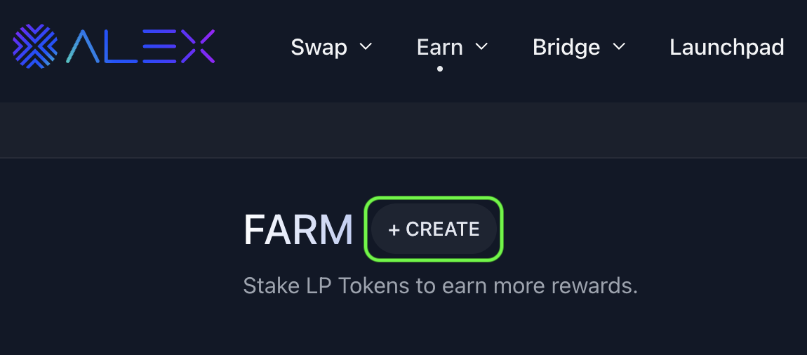
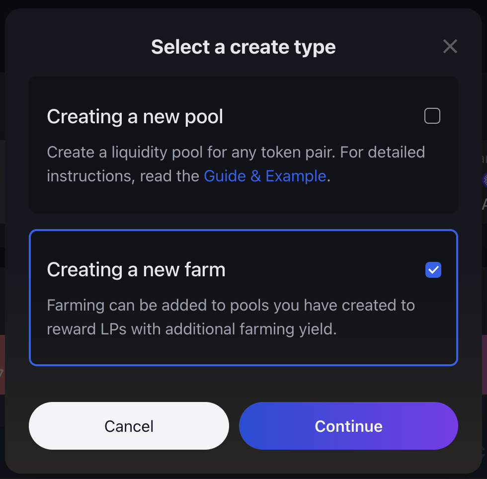
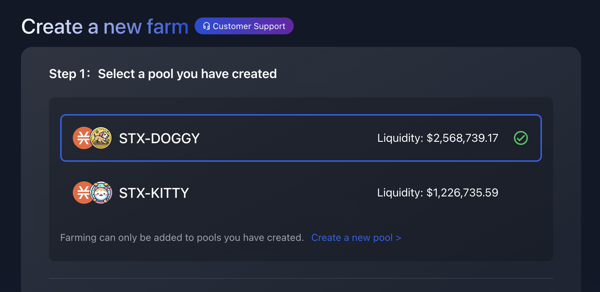
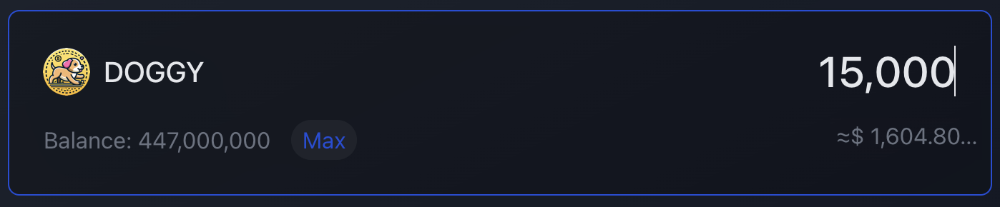
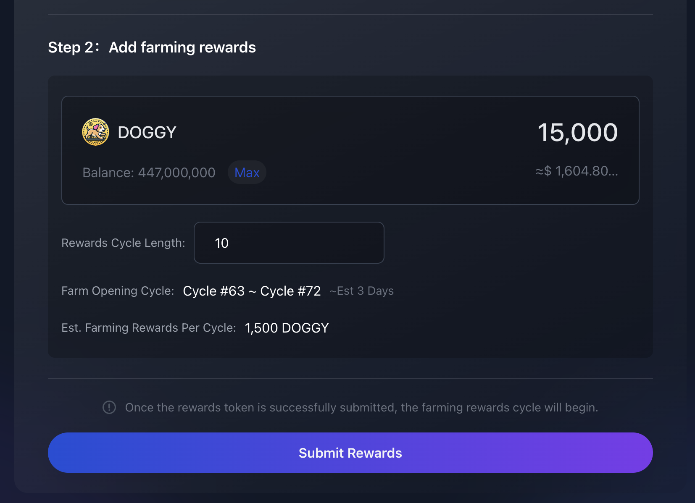

# 🧑‍🌾 Self-Service Farming


You can only add farming to liquidity pools that you have created via the ALEX Self-Service Listing. If you don't have your own pool yet and want to create one, check the [Self-Service Listing](self-service-listing.md) page to find out how.


## 🚀 Getting started

### How it works?

- The pool owner creates the farm by specifying the number of cycles and depositing the total reward amount. These two inputs determine the rewards distributed per cycle, which are equal for each cycle.
- The pool's liquidity providers stake their LP tokens in the newly created farm, earning rewards at the end of each cycle, just like any other farm within the ALEX Lab Platform.

For further details on how farms operate within ALEX, refer to the [Farming Key concepts](farming/key-concepts.md) section of the docs.

### Considerations

Before you start, familiarize yourself with the basic rules of Self-Service Farming.

1. Only the pool creator can use Self-Service Farming to add farming to their pool.
2. When creating a liquidity pool, an anchor token (Token X) and a listing token (Token Y) are defined. Self-Service Farming only allows the listing token to be used as the farming reward.
3. The total amount of rewards for the entire farm lifecycle must be deposited at the time of farm creation.
4. A "gathering" period occurs between the creation of the farm and the start of the first emission cycle. Farmers who stake their LP tokens during this period will be eligible to receive the farming rewards associated with the first emission cycle.

## 📝 Procedure

### Step 1

Go to the [Farms page](https://app.alexlab.co/farm) and click on the "Create" button.

<figure><figcaption></figcaption></figure>

In this guide we are assuming that you already have a pool, so select the "Creating a new farm" option and click "Continue".

<figure><figcaption></figcaption></figure>

### Step 2

Select a pool from the ones you've created.

<figure><figcaption></figcaption></figure>

### Step 3

Enter the total amount of rewards that will be distributed in your farm. This amount is deposited at farm creation. Also, remember that in Self-Service Farming, the reward token has to be the same as the listing token.

<figure><figcaption></figcaption></figure>

### Step 4

Select the **Reward Cycle Length**, which is the number of cycles in which your farm will be active and distributing rewards. This number, along with the total farming rewards, determines the **Est. Farming Rewards Per Cycle**.

At this point, you will also be able to see the number of the cycles in which your farm will be officially open, displayed as **Farm Opening Cycle**. The farm will be created instantly once the farm creation transaction is confirmed. However, the **Emission Start Cycle** will be the next upcoming cycle.

The time gap between the farm creation and the start of the first emission cycle is the so-called "gathering" period, during which users can begin staking their LP tokens in the farm.


**Caution:** To maximize the gathering period, it is advisable to create your farm at the start of a new farming cycle.


<figure><figcaption></figcaption></figure>

#### Example

From the screenshot above, the **Total Farming Rewards** is `15,000 DOGGY`, and **Reward Cycle Length** is `10`, meaning that `15,000 DOGGY / 10 = 1,500 DOGGY` will be the **Farming Rewards Per Cycle**.

If the user submits, the farm will be created at Cycle #80, leaving 33 blocks for the gathering period (approximately 5 hours and 29 minutes). In these cases, it is recommended to wait for the next cycle, as inidicated in the alert box.

If the user decides to proceed, the **Farm Opening Cycle** will run from Cycle #81 to Cycle #90, lasting approximately 35 days.

### Step 5

Once you're ready to move ahead, select the "Submit Rewards" button which will bring up the Confirmation panel. This panel provides a final overview of the farm creation, allowing you to double-check the total rewards and the farm opening period. If everything looks good, click "Confirm" 😎.

<figure><figcaption></figcaption></figure>

### Step 6

After clicking "Confirm", you will need to confirm the transaction in your wallet. Here, your Stacks wallet is interacting with ALEX smart contract and is asking you for approval. Remember, in this farm creation transaction, you are transferring the total amount of rewards to the ALEX smart contract.

Scroll through the wallet transaction window, review it and confirm the transaction. By doing this, you are allowing the wallet to sign and broadcast the transaction.


To be completely sure, you can check:

* The transaction is requested by **"Alex app" (app.alexlab.co)**
* The transfer amount, covered by [Stacks post conditions](https://docs.stacks.co/stacks-101/post-conditions). Note that the amount you transfer to the smart contract is exactly determined (DOGGY in the example). If this condition is not met, the transaction will abort.


### Step 7

Wait for the transaction to be confirmed on the network.


Recommended to track transaction status:

* Turn on Telegram notifications, you will get notified when the transaction is confirmed.
* Search for the transaction on the [ALEX Explorer](https://app.alexlab.co/explorer).
* Check your address activity on the wallet.


### Step 8

Once the transaction is completed, your farm will have been successfully created. Your farm will appear on the [Farms](https://app.alexlab.co/farm) page and from that moment is open to the first farmers who want to join during the gathering period.

Thanks for launching your farm through ALEX Lab! 🌽 🌾 🚜 

## Support

For assistance, please reach out to our Community Managers on [Discord](https://discord.com/invite/alexlab) and [Telegram Channel](https://t.me/AlexCommunity).
