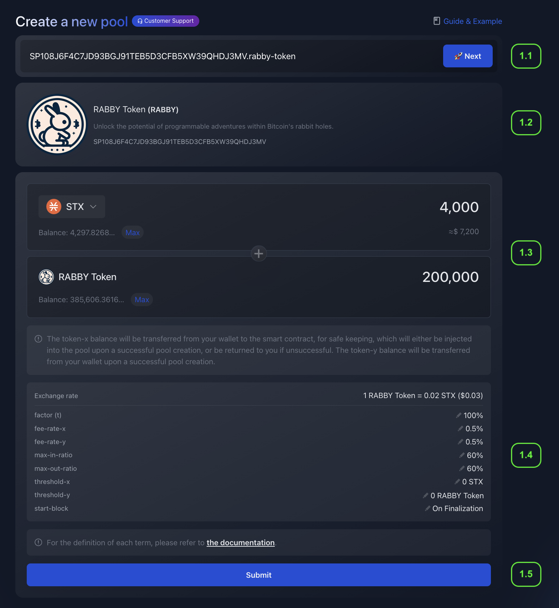

# 📝 Self-Service Listing


**Supported Tokens:** ALEX Self-Service Listing currently supports Stacks Chain Tokens (SIP-010 Standard Token).


## 🚀 Getting Started

### How it works?

Self-Service Listing allows you to **create your own liquidity pool** on the ALEX DEX, enabling the permissionless trade of the **listed token** against a so-called **anchor token** within the exchange. The anchor token is typically one with a stable value, providing a reliable reference point for defining the price of the newly listed token.

Pool creation typically takes between 24 to 48 hours. Once the pool is created, the price discovery phase begins: users can start trading the listed token with the anchor token and viceversa. Users interested in providing liquidity will be able to do it as in any other ALEX pool.


**Avaiblable Anchor Tokens:** Native _STX_ currency, _ALEX_ token and _aBTC_ token.


The trading pool is ruled by [ALEX Automated Market Maker (AMM)](../../detailed-information/alexs-automated-market-maker-amm.md) algorithm which determines the exchange rate (price) and balances dynamic.

### Minimum requirements

👉 **Token Deployment.** Have your token deployed on Stacks blockchain since you will need to provide the token contract.

👉 **Select an Anchor Token.** Choose an anchor token from the available options: Stacks native currency _STX_, _ALEX_ token, or _aBTC_ token. Ensure you have at least 1,800 _STX_ or an equivalent value in _ALEX_ or _aBTC_ token to create the pool—this is the minimum anchor token liquidity.

👉 **Determine Initial Price.** Decide the initial price for your listing token in terms of anchor token units. This should answer the question: how many anchor tokens do users need to buy one listed token?

👉 **Calculate Initial Liquidity.** Once the initial price is determined, you can set the initial liquidity amounts for both tokens in the pool. You may calculate this manually or use the ALEX Lab UI for assistance. If you're planning to [add farming to the pool](self-service-farming.md), make sure to reserve enough tokens for farm rewards.

Manual calculation example (price, ratio, and initial amounts)

Let's suppose you choose STX as the anchor token and want to provide 4,000 STX as the initial anchor token liquidity.

To determine the price, you will need to decide how many STX equals 1 of your listing token. In other words, decide how many STX users will need to buy 1 listed token. Let's say you set the price of your token at 0.5 STX.

To calculate the initial liquidity for the listed token, you need to divide the anchor token amount by the price. This is `4,000 STX / 0.5 STX = 8,000`, resulting in the initial amount for the listed token.

The liquidity pool for the pair **Listed Token :rocket: - Anchor Token :anchor:** will have an initial ratio of 2:1. This ratio is calculated as the minimal expression of the fraction `8,000 / 4,000` (initial listed token amount slash initial anchor token amount).

🔎 For more details, check the [FAQs](liquidity-providers/faqs.md#self-service-listing) section.

With that said, let's get hands-on!

## 🛠️  Procedure

### Step 0: Go to Self-Service Listing page

Go to the [Self-Service Listing page](https://app.alexlab.co/self-service-listing) at the ALEX Lab App. You can also reach it by going to the [app.alexlab.co](https://app.alexlab.co) main page and navigating to the `Swap` -> `Pool` tab. Once in the Pool main page, hit the `+ Create` button and select the `Creating a new pool` option.

<figure><figcaption></figcaption></figure>

### Step 1: Submit token information & deposit the anchor token

In this step, you will set up the pool trading pair and config params. Within this same transaction, you will transfer the anchor token balance :anchor:.

<figure><figcaption></figcaption></figure>

Step 1.1: Input the SIP-10 token contract address

Provide the listed token contract address. Remember that it must accomplish with the [SIP-010 Fungible Token Standard](https://github.com/stacksgov/sips/blob/main/sips/sip-010/sip-010-fungible-token-standard.md) trait. In the example, its `SP108J6F4C7JD93BGJ91TEB5D3CFB5XW39QHDJ3MV.rabby-token`.

Step 1.2: Confirm token information provided by the contract

Check the that information provided by the contract is correct. In the example would be:

- **Token name** -> `RABBY Token`
- **Token symbol** -> `RABBY`
- **Description** -> Unlock the potential of programmable adventures within Bitcoin's rabbit holes.
- **Token deployment address** -> `SP108J6F4C7JD93BGJ91TEB5D3CFB5XW39QHDJ3MV`
- **Token logo**

Step 1.3: Set the initial liquidity and price

Enter the initial balances of the tokens. You can try different amounts and see how the exchange rate variates. However, we recommend making the calculations previously.

In the screenshot example, this is:

- **Anchor Token ⚓** (a.k.a `token-x`) -> `4,000 STX ($7,200)`
- **Listing Token 🚀** (a.k.a `token-y`) -> `200,000 RABBY`
- **Exchange Rate ⚖️** -> `1 RABBY = 0.02 STX ($0.03)`

Once the pool opens, the exchange rate of the AMM pool will be automatically re-balanced as users trade the tokens.

Step 1.4: Advanced pool settings (optional)

This step is optional, as you can keep the default settings. A brief explanation of each setting is explained below.

TODO:

- `factor`:
- `fee-rate-x`:
- `fee-rate-y`:
- `max-in-ratio`:
- `max-out-ratio`:
- `threshold-x`:
- `threshold-y`:
- `start-block`:

For a more detailed treatment of the subject, please refer to the [ALEXGo Trading Pool documentation](https://docs.alexgo.io/automated-market-making/trading-pool) documentation.

Step 1.5: Submit transaction

### Step 2

<!-- 2) User waits for token confirmation from ALEX side (this involves deploying the wrapped version, but the user doesn't get to know this detail) -->

Wait for the wrapped token contract creation (around 24-48 hours).

### Step 3

<!-- 3) User deposits the listed token balance. -->

Deposit the listing token :rocket: and the pool will be automatically created on ALEX's AMM DEX. The new pool will be listed as an ALEX Pool in the Self Listed tab on [app.alexlab.co/pool](https://app.alexlab.co/pool).

🤝 After this step, you (and everyone) can start trading your token in ALEX DEX 🤝

### Step 4 

<!-- 4) Once this tx is confirmed, the pool is automatically created and available? (if start-block is configured "On finalization") Or there is a waiting period here? -->

### Step 5

Provide additional token information and make your token visible on the ALEX Token List at [app.alexlab.co/token-list](https://app.alexlab.co/token-list). To do so, click "Customer Support" on the [Self-Service Listing page](https://app.alexlab.co/self-service-listing) and submit the social media information, such as X accont, Discord, official website, etc.