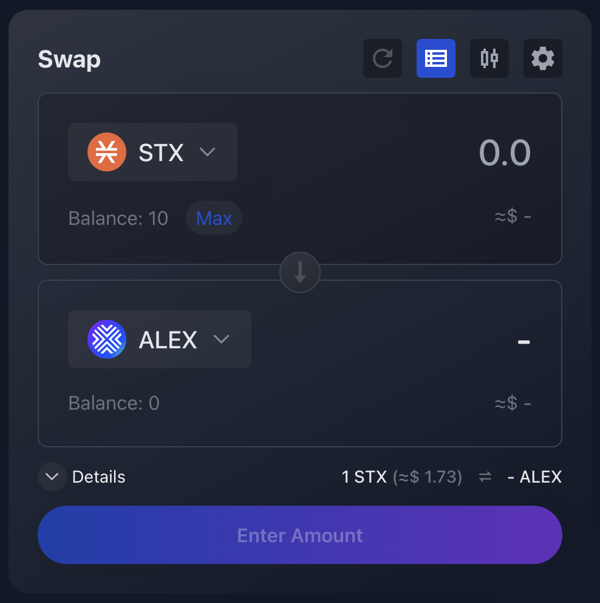

# How to swap

## :currency_exchange: :moneybag: Trade one token for another 

### Step 1

Go to [https://app.alexlab.co/](https://app.alexlab.co/).

<figure><figcaption></figcaption></figure>

You can also click the Swap tab on the top menu bar to go to the Swap panel:

<figure><figcaption></figcaption></figure>

### Step 2

Select the tokens you want to exchange and the amount.


**:bulb: Key information**

- The token at the top is the **base** token, the token you currently hold and want to exchange.
- The token below is the **quoted** or **target** token, the token you will receive on the trade.
- The central down-pointing arrow, shows the direction of the transaction; in this example, STX will be exchanged for ALEX.
- Below the amounts, you will find the current exchange rate, as well as the USD equivalent.


<figure><figcaption></figcaption></figure>
