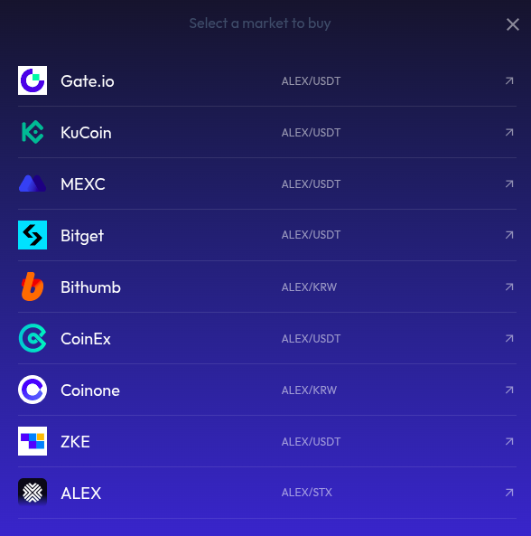

# 🪙 How to Buy ALEX Tokens

Starting from the [AlexLab](https://alexlab.co/) website, if you click on the `Buy ALEX` button, it will display all the available markets where the ALEX token can be purchased.

<figure><figcaption></figcaption></figure>

The procedure will be different depending on the marketplace you choose to buy ALEX tokens. 

## Using ALEX Lab Platform

If you decide to use the [ALEX Lab](https://app.alexlab.co/swap) platform (the last option on the list), you can follow these steps:

1. First, connect your wallet. You can follow this step-by-step guide: 
[How to connect your wallet](https://docs.alexlab.co/getting-started/how-to-connect-your-wallet)

2. Next, depending on which blockchain you are using, follow the appropriate path to obtain ALEX tokens:

- **Bitcoin users**: Use the Bitcoin Native Swap to get ALEX BRC-20 or Runes.
  - 📘 [Step-by-step guide](https://docs.alexlab.co/what-can-you-do/bitcoin-swaps/how-to)
  - 🔁 [Bitcoin Swap page](https://app.alexlab.co/bitcoin/swap/)
- **Stacks users**: Use the Stacks Swap to acquire ALEX tokens directly on the Stacks L2.
  - 📘 [Step-by-step guide](https://docs.alexlab.co/what-can-you-do/stacks-swaps/how-to)
  - 🔁 [Stacks Swap page](https://app.alexlab.co/swap)
  - To see which tokens you can trade in exchange for ALEX coins using the Stacks Swap, check this [token list](https://app.alexlab.co/token-list)
- **Users on other blockchains (e.g. Ethereum, BNB)**: First, bridge your assets to either Stacks or Bitcoin, and then follow the appropriate method above.
  - 🌉 [Bridge page](https://app.alexlab.co/bridge/cross-bridge)

## Move ALEX Across Different Chains

Once you have ALEX tokens on one blockchain, you can use the ALEX Lab Bridge (powered by [Brotocol 👥](https://brotocol.xyz/about)) to bridge ALEX across different blockchain ecosystems.

<figure><figcaption>Transfer ALEX from Ethereum to Stacks.</figcaption></figure>

You can check Brotocol's [step-by-step guide](https://docs.brotocol.xyz/what-can-you-do/brobridge/how-to-bridge) for more information.
